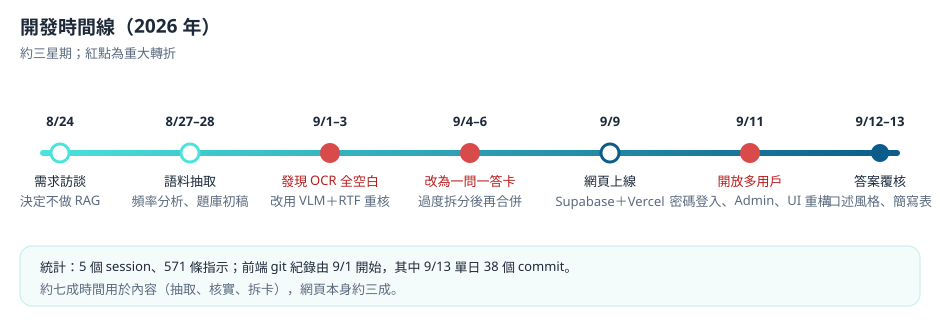
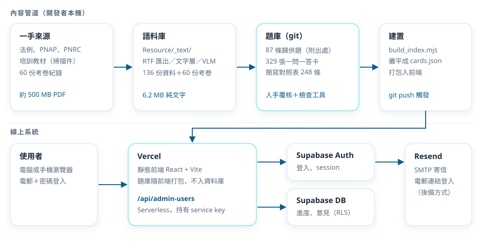
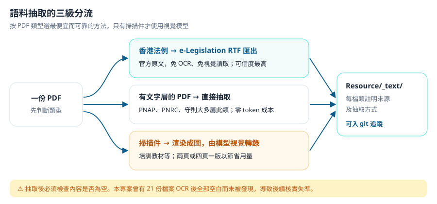
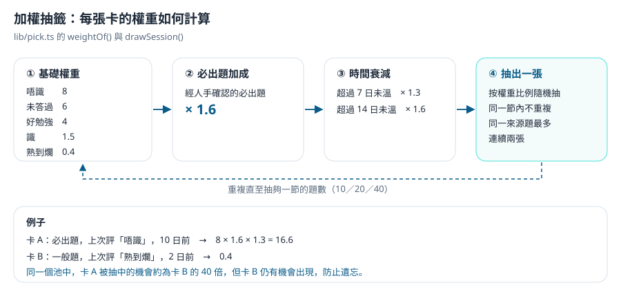
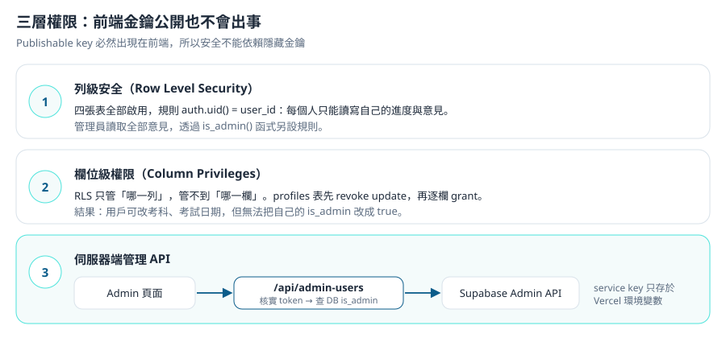

# 緣起 {Origin} {#origin}

## 構思起點 {The Spark}

Crimson Lau（CKW Group）機緣巧合下接觸到獲授權簽署人（AS）面試的準備工作，手上累積了兩類材料：一批法例、作業備考及守則的 PDF，以及流傳的考卷紀錄。

最初的想法很簡單：做一個溫書網頁。但對「溫書工具應該是甚麼樣子」沒有既定想法，也不確定應否使用 RAG（Retrieval-Augmented Generation）。當時已用 NotebookLM 對筆記提問，答案質素令人滿意，所以真正的問題是：**自己再做一個工具，價值在哪裏？**

經過一輪需求訪談，答案逐漸清晰：NotebookLM 擅長「回答問題」，但無法告訴你**該溫哪些問題、溫到甚麼程度**。這個工具要解決的是後者。

成品網址：[as-exam-training.vercel.app](https://as-exam-training.vercel.app/)（受邀用戶登入使用）。

## 要解決的問題 {Problem}

1. **不知道考甚麼。** 考卷紀錄由考生憑記憶寫成，同一考點有多種問法。需要把 60 份考卷的題目歸納，並計算每個考點的出現頻率。
2. **答案沒有可靠來源。** 考卷只有問題，沒有答案；培訓教材經核實後發現多處過時或錯誤。每個答案都必須能追溯至一手原文。
3. **溫習沒有焦點。** 評分表六個範疇中，Aspect 1、2 為一票否決，但題目最少。需要一個按掌握度與重要性分配溫習時間的機制。
4. **最終要給同事使用。** 第一版只供本人使用，但架構必須可以開放給公司其他考生。

## 範圍 {Scope}

| 做 | 刻意不做 |
|---|---|
| 抽認卡：出題、心中作答、揭曉、四級自評 | **模擬面試**：口試的評分依賴臨場表達，工具難以評估，投入大而回報不確定 |
| 按自評與重要性加權出題 | **在應用程式內接入 LLM**：答案必須可追溯，即時生成的內容無法逐字核實 |
| 每題附出處，可追溯至法例原文 | **向量 RAG**：語料約七十萬 token，關鍵是條號與專有代號的字面匹配，向量檢索反而容易拉回「意思相近但條號不同」的內容 |
| 跨裝置同步進度、多用戶 | **自助註冊與重設密碼**：用戶數量少，由管理員逐一開設更安全 |
| 管理員開帳號、收取答案意見 | **網頁內編輯題庫**：題庫改動需要核實，留在 git 由開發者處理 |

# 工具與成本 {Tools & Cost} {#tools-cost}

## AI Agent 與模型 {Agent & Models}

| 項目 | 用途 |
|---|---|
| Claude Code（桌面版） | 全部開發工作：需求訪談、語料抽取、題庫撰寫、網頁實作、部署指引 |
| Claude Opus 5 | 主力模型，負責內容核實及架構決策 |
| Claude Sonnet 4.6 | 部分較機械性的批次工作 |
| 模型原生視覺能力 | 讀取掃描件 PDF（培訓教材、部分法例列印本），毋須外部 OCR 服務 |
| NotebookLM | 由產品擁有人以另一個 AI 工具交叉核對答案，作為最後把關 |
| Skill：grilling | 需求訪談，逐條確認設計決策 |
| Skill：starter-session-audit、end-of-day | 每日收工時整理決策與進度 |

## 開發工具 {Dev Tools}

| 工具 | 用途 | 收費 |
|---|---|---|
| Node.js 24 | 前端建置、題庫索引腳本 | 免費 |
| Python 3.14 | 語料抽取、頻率統計、卡片檢查工具 | 免費 |
| PyMuPDF 等 PDF 工具 | 渲染 PDF 頁面供視覺讀取、抽取文字層 | 免費 |
| Tesseract OCR | 曾嘗試用於掃描件，實測無效（見 [[#journal-ocr]]） | 免費 |
| Git 與 GitHub（私人 repo） | 題庫版本控制；push 觸發部署 | 免費 |

:::gap
PDF 處理所用的具體 Python 套件名稱由工具腳本推斷，未逐一核對 `requirements`。
:::

## 第三方服務 {Services}

| 服務 | 用途 | 收費 |
|---|---|---|
| Supabase | 登入驗證、進度與意見資料庫 | 免費方案 |
| Vercel | 前端託管、Serverless Function | 免費方案（Hobby） |
| Resend | 自訂 SMTP 寄信（電郵連結登入的後備方式） | 免費方案 |
| e-Legislation 電子版香港法例 | 以 RTF 匯出法例官方原文 | 免費 |

## 開發成本 {Build Cost}

- **AI：** Claude 付費訂閱，沒有額外 API 費用。開發期間多次用盡訂閱的用量上限，需要等候重置後繼續。
- **時間：** 由 2026 年 8 月 24 日需求訪談至 9 月 13 日，約三星期，共 5 個 session、571 條指示。
- **分佈：** 約七成時間用於內容（抽取、核實、拆卡、覆核），網頁本身約三成。



## 運作成本 {Running Cost}

每月 **US$0**，但每個免費方案都有限制：

| 服務 | 免費方案限制 | 超出或違反時 |
|---|---|---|
| Supabase | 資料庫 500 MB；**連續一星期無活動會暫停專案** | 需要到控制台手動恢復；資料不會遺失 |
| Vercel Hobby | 只限個人、非商業用途 | 如正式在公司內推廣，按條款應升級 Pro（每位成員每月約 US$20） |
| Resend | 每月 3,000 封、每日 100 封；未驗證網域只能寄往註冊電郵 | 本產品主要用密碼登入，電郵只作後備，用量極低 |

:::warn 免費方案條款會變動
以上為撰寫時（2026 年 9 月）的情況，請以各服務官方頁面為準。
:::

# 技術架構 {Architecture} {#architecture}

## 系統總覽 {Overview}



整個系統分為兩條線：

1. **內容管道（離線）。** 一手來源經抽取成為純文字語料，再由 AI 撰寫成附出處的題庫 JSON，存於 git。題庫的每一次修改都有版本紀錄。
2. **線上系統。** 建置時把題庫打包進前端，部署到 Vercel。**題庫一個字都不入資料庫**；Supabase 只存用戶進度與意見。

這個分割令內容更新毋須改動前端：修改 JSON、push，Vercel 會自動重新建置。

## 後台技術 {Backend & IT} {#backend}

**技術棧**

| 層 | 用甚麼 | 為甚麼 |
|---|---|---|
| 前端 | React 19、Vite 8、Tailwind CSS 4、TypeScript 6 | 開發者已有實戰經驗；Tailwind 的響應式工具令手機版只需調整斷點 |
| 狀態管理 | Zustand 5 | 登入狀態、進度、簡寫彈出卡等跨頁面狀態；比 Context 少 boilerplate，不會引起整棵樹 re-render |
| 路由 | React Router 7 | 標準做法 |
| Markdown | react-markdown 10、remark-gfm | 答案含表格與重點標記，需要完整 Markdown 支援 |
| 題庫 | git 內的 JSON，建置時打包 | 內容需要版本紀錄與人手核實；約 570 KB 的資料毋須資料庫查詢 |
| 登入與資料 | Supabase（Auth、Postgres、RLS） | 內建電郵密碼登入與列級安全，毋須自建後端 |
| 管理 API | Vercel Serverless Function | 建立用戶需要 service key，該金鑰絕不能出現在前端 |
| 部署 | Vercel | 與 GitHub 連動，push 即部署；同時提供 Serverless Function |

**檔案樹**

```text
as-exam-training/
├── data/
│   ├── questions/       87 條歸併題：完整答案、出處、考卷原文變體
│   ├── cards/           329 張一問一答卡（應用程式實際使用的單位）
│   ├── glossary.json    簡寫對照表 248 條
│   ├── exam-info.json   考試形式與合格準則
│   └── topics.json      12 個知識範疇
├── Resource/
│   ├── Notes/、Papers/  原始 PDF（不入 git，約 500 MB）
│   └── _text/           抽取後的純文字語料（入 git）
├── tools/               抽取、頻率統計、索引、卡片檢查、風格防線腳本
├── api/
│   └── admin-users.js   管理員用戶管理 Serverless Function
├── web/
│   ├── src/             React 前端（pages、components、lib、store）
│   └── supabase/        schema.sql、make-admin.sql
├── SPEC.md              資料層規格
├── SPEC-WEB.md          網頁規格
└── vercel.json          建置設定、SPA rewrite、noindex
```

**卡片結構**（`data/cards/*.json`，精簡版）

```json
{
  "id": "C-0035-03",
  "from": "Q-0035",
  "question": "重寫成清楚、自足的問題",
  "answer": "只回答這一條問題的 Markdown 答案",
  "answer_ref": "Q-0035 §四",
  "aspect": [3, 6],
  "topic": "site-safety",
  "variants": ["考卷中的原本問法"],
  "note_for_candidate": "陷阱與追問方向"
}
```

**資料表**（`web/supabase/schema.sql`）

| 表 | 內容 | 特點 |
|---|---|---|
| `reviews` | 每次自評一列：`card_id`、`rating`（0 至 3）、`session_id`、時間 | 只增不改（append-only） |
| `sessions` | 每節練習：抽出的 `card_ids`、模式、開始及結束時間 | |
| `profiles` | 考科、是否包括 RGBC 題、考試日期、`is_admin`、`onboarded` | 新用戶由 trigger 自動建立 |
| `card_comments` | 用戶對答案的意見：類別、內容、處理狀態 | 管理員可讀取全部 |

**外部接口**

| 接口 | 說明 |
|---|---|
| `POST /api/admin-users` | 只接受四個固定操作：`list`、`create`、`reset_password`、`delete`。每次呼叫都核實 token 有效，並在伺服器端查詢 `is_admin` |
| Supabase 環境變數 | 前端：`VITE_SUPABASE_URL`、`VITE_SUPABASE_ANON_KEY`（建置時編譯入 bundle）；伺服器端：`SUPABASE_SERVICE_ROLE_KEY`（只存於 Vercel） |

## AI 技術 {AI Techniques} {#ai}

應用程式本身**沒有**使用任何 AI。AI 集中用於開發階段的內容生產，而且每一步都設有防錯機制。

### 語料抽取的三級分流 {Three-Tier Extraction}



關鍵在於**按 PDF 類型選擇最便宜而可靠的方法**。一頁 A4 渲染成圖片後，視覺讀取約耗 2,300 token；全數八百多頁都用視覺讀取，會消耗大量訂閱用量。所以只有真正的掃描件才使用視覺模型，法例一律改用官方 RTF 匯出。

### 考點歸併與頻率統計 {Question Clustering}

AI 讀取全部 60 份考卷，把「同一考點的不同問法」歸併為一條題目，並把每一條原文保存在 `variants` 中。頻率由程式計算：

- **歷來比例：** 出現該考點的考卷數 ÷ 60。
- **近兩年比例：** 最近 24 個月的考卷數 ÷ 32。

兩個數字並列顯示。「歷來低、近期高」代表新興熱題，是最有預測力的訊號。

### 附出處的答案撰寫 {Sourced Answer Drafting}

AI 撰寫答案時必須遵守三條規則：

1. 每個數字、條號、期限都要標明出處，指到條文層級。
2. 語料中找不到明確依據的內容，寫入 `gaps`，不准自行補充。
3. 來源分級：法例原文優先於作業備考，作業備考優先於培訓教材。

產品擁有人再以 NotebookLM 交叉核對，形成「AI 起草、另一個 AI 核對、人手裁決」的流程。

### 風格改寫的硬資料防線 {Style Guard}

後期把全部答案改寫成「考生對考官口述」的第一人稱風格。為免改寫時誤改事實，`tools/style_guard.py` 會抽出改寫前後的「硬資料」（條號、規例、金額、日數、表格編號），**舊版有而新版沒有的，一律判為失敗**。這條防線取代了逐張人手檢查。

## 核心邏輯 {Core Logic}

### 加權抽籤 {Weighted Draw} {#logic-draw}



兩個細節值得留意：

- **未答過的新卡權重為 6**，排在「唔識」與「好勉強」之間。這令新卡較早出現，但不會壓過已知的弱項。
- **同一來源題最多連續抽兩張。** 一條來源題可能拆成十多張卡，連續出現會令人產生「剛剛才答過」的虛假熟悉感。

### Append-only 進度 {Append-only Progress} {#logic-append}

每次自評寫入 `reviews` 一列，永不修改。「每張卡目前的掌握度」由 `deriveStates()` 從全部紀錄推導：取時間最新的一列作為當前評級，同時累計作答次數。

好處是溫習軌跡完整保留，可以看到「哪一張卡反覆由識變回唔識」，將來亦可據此調整權重算法，毋須遷移資料。

寫入失敗時，自評先在畫面上即時更新，同時放入 `localStorage` 佇列，下次開啟應用程式時自動補交，主頁會顯示未上傳的數量。**寫入失敗不可以靜靜地消失**，否則用戶以為進度已儲存。

### 出現頻率於建置時預算 {Build-time Frequency} {#logic-frequency}

頻率百分比由 `tools/compute_frequency.py` 在更新題庫時計算並寫入 JSON，附 `computedAt` 日期，**不在瀏覽器即時計算**。

即時計算的效能其實不是問題（三百多張卡只需數毫秒），選擇預算的真正理由是：數字會進入 git，可以從 diff 看到「某題的出現率何時由 32% 升至 41%」。

### 三層權限模型 {Permission Model} {#logic-permission}



Supabase 的 publishable key 必然出現在前端 bundle 中，任何人都可以取得。所以安全性不能建立在「隱藏金鑰」上，而要建立在資料庫規則上。

### 簡寫比對 {Abbreviation Matching} {#logic-glossary}

答案中的簡寫會自動加上虛線，點擊可查看說明。比對規則：

1. **由長到短。** `RSC(GIFW)` 優先於 `RSC`，`Cap 123A` 優先於 `Cap`。
2. **邊界人手檢查。** 不使用正規表達式的 lookbehind，因為 iOS Safari 16.4 之前不支援，會令整個 bundle 在舊款 iPhone 上無法載入。
3. **揭答案前只顯示題目中的簡寫。** 避免本卡簡寫列提早透露答案用到的概念。

# 逐步教學 {Build Step-by-Step} {#build}

以下是重建同類產品的最短路徑。步驟已經重新排序及合併，不代表實際開發次序；實際過程中的轉折見 [[#journal]]。

每一步的指令可以直接貼給你的 AI agent（例如 Claude Code）。

## 階段一：建立語料庫 {Phase 1: Corpus}

完成後，你會有一個可以用關鍵字搜尋的純文字語料庫，每份檔案都註明來源及抽取方式。

### 整理來源資料夾 {#step-folders}

:::prompt Step 1 指令
建立專案資料夾，結構如下：
- Resource/Notes/：放法例、作業備考、守則、教材的 PDF
- Resource/Papers/：放考卷紀錄
- Resource/_text/：之後放抽取出來的純文字
- data/、tools/

設定 .gitignore：排除 Resource/Notes 及 Resource/Papers 內的 PDF，但保留 Resource/_text。
然後列出兩個 PDF 資料夾內每份檔案的頁數，並判斷每份是否有文字層。
:::

:::check
- `git status` 不會列出任何 PDF。
- AI 交回一張表，每份 PDF 標示「有文字層」或「掃描件」。
:::

### 以官方 RTF 匯出香港法例 {#step-rtf}

:::prompt Step 2 指令
香港法例不要用 OCR。請用電子版香港法例的 RTF 匯出端點下載以下法例的中文及英文版：
Cap 123、Cap 123A、Cap 123Q、Cap 59（按我的考試範圍增減）。
網址格式：https://www.elegislation.gov.hk/hk/cap123!zh-Hant-HK.rtf
寫一個 tools/rtf2txt.py 把 RTF 轉成純文字（要處理 \uc 的 Unicode fallback），
輸出到 Resource/_text/notes/，每個檔案開頭加 HTML 註釋，寫明來源網址、抽取方式及日期。
:::

:::check
- `Resource/_text/notes/` 出現法例文字檔，中文內容沒有亂碼。
- 隨機抽一條條文（例如 Cap 123A reg 32），與網上版本逐字相同。
:::

### 抽取有文字層的 PDF {#step-text}

:::prompt Step 3 指令
對 Step 1 表中「有文字層」的 PDF，直接抽取文字到 Resource/_text/，
每檔開頭同樣加來源註釋，extraction 寫 text。
抽完後列出每份檔案的字數。字數少於 200 的，標記為可疑，不要當成功。
:::

:::check
- 每份輸出檔都有字數統計。
- 沒有任何檔案只有 `[NO TEXT LAYER]` 或空白內容。
:::

:::warn 抽取結果必須檢查是否為空
工具不會因為讀不到文字而報錯，只會輸出空檔。一定要檢查字數。
:::

### 以視覺模型轉錄掃描件 {#step-vlm}

:::prompt Step 4 指令
對「掃描件」PDF，把頁面渲染成 JPEG（大字投影片可以兩頁或四頁一版以節省用量），
然後用你的視覺能力逐頁轉錄成文字，保留表格結構。
每檔開頭註明 extraction: vlm。
轉錄完成後，抽 10 個關鍵數字或條號，與原圖再核對一次，交回核對表。
:::

:::check
- 掃描件都有對應的文字檔。
- 核對表中 10 個抽樣全部相符。
:::

:::note 為何不用 Tesseract
Tesseract 對清晰的文字 PDF 尚可，但對掃描件中的繁體中文表格、條號與數字錯誤率高，本專案實測輸出全部空白。模型視覺轉錄較耗用量，但準確度高，而且能保留表格結構。
:::

## 階段二：題庫結構與頻率 {Phase 2: Question Bank}

完成後，你會有一份歸併了全部考卷考點、附頻率數字的題庫 JSON。

### 定義題庫結構 {#step-schema}

:::prompt Step 5 指令
先不要寫任何題目。請設計題庫 JSON 的欄位並寫成 SPEC.md，至少包括：
id（Q-0001 格式，永不重用）、question、answer（Markdown）、sources（doc、ref、verified）、
aspect（對應評分表 1 至 6）、tier（must 或 optional）、must_confirmed（只有人可以設為 true）、
topic、stream_relevance（common、foundation-core、rgbc-only）、raw_variants（paper、text）。
把 SPEC.md 交給我確認，確認前不要生成題目。
:::

:::check
- `SPEC.md` 存在，每個欄位都有型別及意思說明。
- 文件明確寫出「AI 不可以把 must_confirmed 設為 true」。
:::

### 歸併考卷考點 {#step-cluster}

:::prompt Step 6 指令
讀取 Resource/_text/papers/ 全部考卷。把「同一個考點的不同問法」歸併為一條題目，
每條原文連同出自哪份考卷，存入 raw_variants。
問題寫得太簡略看不明白時，參考前後一兩條問題推斷語境，並把推斷標記為 inferred。
輸出到 data/questions/，先不寫答案。最後交回：題目總數、每條的變體數量。
:::

:::check
- `data/questions/` 內的 JSON 可以被 `JSON.parse` 讀取。
- 全部變體數量加起來，等於考卷原始問題總數。
:::

### 計算出現頻率 {#step-frequency}

:::prompt Step 7 指令
寫 tools/compute_frequency.py：
- 考卷檔名先正規化（大小寫、日期格式不一致的要合併為同一份）
- 引用了不存在考卷的變體，標記 paper_missing，不計入頻率
- 計算 frequency_pct（分母 = 全部考卷數）及 frequency_pct_recent（分母 = 最近 24 個月的考卷數）
- 結果寫回每條題目，並在 data/frequency-meta.json 記錄分母及 computedAt 日期
:::

:::check
- 執行後每條題目都有兩個百分比。
- `frequency-meta.json` 記錄的分母與實際考卷數一致。
:::

:::warn 考卷檔名不一致會令頻率虛高
同一份考卷若有兩個大小寫不同的檔名，會被計成兩份。先正規化再計算。
:::

## 階段三：撰寫答案與拆卡 {Phase 3: Answers & Cards}

完成後，你會有可直接用於溫習的一問一答卡，每張答案都有出處。

### 撰寫附出處的答案 {#step-answers}

:::prompt Step 8 指令
按 frequency_pct_recent 由高至低，為每條題目撰寫答案。規則：
1. 先用關鍵字在 Resource/_text/ 搜尋相關條文，再全文閱讀，不要憑記憶作答
2. 每個數字、條號、期限都要寫入 sources，指到條文層級
3. 找不到依據的內容寫入 gaps，不要自行補充
4. 法例原文與教材不一致時，以法例為準，並在 note_for_candidate 註明分歧
每完成 5 條停下，交回清單讓我核對。
:::

:::check
- 每條答案的 `sources` 不為空。
- 隨機抽一個數字，可以在 `Resource/_text/` 找到原文。
:::

### 拆成一問一答卡 {#step-cards}

:::prompt Step 9 指令
把 data/questions/ 的每條大題拆成一問一答的卡，存入 data/cards/Q-XXXX.json。
- 卡的 question 要重寫成清楚、自足的問題，不要直接用考卷原文
- answer 只回答這條問題，不多不少，平均約 220 至 300 字
- 只從原答案抽取，不加入新事實
- variants 只保留真正在問這張卡的考卷原文
- 不要過度拆分：兩張卡答案幾乎一樣，或者對應同一條考卷原文，就要合併
:::

:::check
- 每張卡都有 `id`、`from`、`question`、`answer`。
- 抽三張卡，答案都只回答卡面的問題。
:::

### 建立卡片檢查工具 {#step-check-cards}

:::prompt Step 10 指令
寫 tools/check_cards.py，檢查四個過度拆分的訊號：
1. variants 為空的卡（沒有考卷這樣問過）
2. 同一來源題內，兩張卡答案文字相似度大於 0.30
3. 兩張卡對應同一條考卷原文
4. 跨來源題的答案相似度大於 0.35
輸出需要人手判斷的清單。
:::

:::check
執行 `python tools/check_cards.py` 會列出可疑的卡片組合；處理後再執行，清單變短。
:::

## 階段四：本機抽卡應用程式 {Phase 4: Local App}

完成後，你可以在本機瀏覽器用抽認卡溫習，暫時未有登入與同步。

### 建立前端與題庫索引 {#step-frontend}

:::prompt Step 11 指令
在 web/ 建立 React + Vite + TypeScript + Tailwind CSS 專案，狀態管理用 Zustand。
寫 tools/build_index.mjs（用 Node，不用 Python，因為部署平台的建置環境未必有 Python），
把 data/cards/*.json 攤平成 web/src/data/cards.json。
在 web/package.json 加 predev 及 prebuild 自動執行這個腳本，輸出檔不入 git。
:::

:::check
- `npm run dev` 前會自動產生 `cards.json`。
- `git status` 不會列出 `cards.json`。
:::

### 實作抽卡與自評 {#step-draw}

:::prompt Step 12 指令
在 web/src/lib/pick.ts 實作：
- weightOf(card, state)：基礎權重 唔識 8、未答過 6、好勉強 4、識 1.5、熟到爛 0.4；
  必出題 ×1.6；超過 7 日未溫 ×1.3，超過 14 日 ×1.6
- drawSession(cards, states, opts)：按權重不重複抽出 N 張，同一來源題最多連續兩張
- deriveStates(reviews)：由自評紀錄推導每張卡的最新評級
答題畫面：顯示題目 → 按 Space 揭答案 → 按 1 至 4 自評 → 下一張 → 節結報告。
先把自評存在記憶體，不接資料庫。
:::

:::check
- 開一節 10 題，可以用鍵盤完成全部流程並看到節結報告。
- 故意全部評「唔識」，再開一節，同一批卡明顯較多重複出現。
:::

## 階段五：進度同步 {Phase 5: Sync}

完成後，進度會儲存在雲端，電腦與手機看到同一份進度。

### 建立 Supabase 專案與資料表 {#step-supabase}

:::prompt Step 13 指令
寫 web/supabase/schema.sql，可以重複執行不會破壞資料：
- reviews（append-only 自評）、sessions、profiles、card_comments 四張表
- 四張表全部 enable row level security，policy 為 auth.uid() = user_id
- profiles 用欄位級權限：revoke update 後只 grant stream、include_rgbc、exam_date、onboarded
- 新用戶註冊時由 trigger 自動建立 profiles 列
然後一步一步教我在 Supabase 控制台建立 Free 方案專案並執行這段 SQL。
:::

:::check
在 SQL Editor 執行以下查詢，四張表的 RLS 均為 true：

```sql
select tablename, rowsecurity from pg_tables where schemaname = 'public';
```
:::

:::warn 建立組織時要選 Free
新帳號會先要求建立 Organization。如果中途出現信用卡頁面，代表選了付費方案，返回上一步改為 Free。
:::

### 接駁登入與寫入 {#step-auth}

:::prompt Step 14 指令
前端接入 Supabase：
- 以電郵加密碼登入；在 Supabase 關閉公開註冊
- 自評先樂觀更新畫面，寫入失敗時放入 localStorage 佇列，下次開啟時補交，主頁顯示未上傳數量
- 每次寫入都要檢查 error，失敗不可以靜靜忽略
- 登出後把網址重設為根目錄，避免下次登入停留在上一頁
VITE_SUPABASE_URL 及 VITE_SUPABASE_ANON_KEY 放在 web/.env，並加入 .gitignore。
:::

:::check
- 在電腦答一題評「唔識」，在另一個瀏覽器登入同一帳號，主頁顯示同一個數字。
- 刻意把 profiles 的一次寫入改成錯誤欄位，畫面會顯示錯誤而不是假裝成功。
:::

:::warn upsert 會被欄位級權限擋住
`upsert` 遇到已存在的列時會嘗試更新全部欄位，包括沒有被 grant 的 `user_id`，整個更新會被拒絕。如果同時沒有檢查 error，症狀是「設定每次登入都要重填」。改用只更新允許欄位的 `update`。
:::

## 階段六：部署 {Phase 6: Deploy}

完成後，任何裝置都可以透過網址使用。

### 部署到 Vercel {#step-vercel}

:::prompt Step 15 指令
寫 vercel.json：
- buildCommand 先安裝 web 的依賴再建置，outputDirectory 為 web/dist
- rewrites 用 "/((?!api/).*)" 指向 /index.html（不要用 "/(.*)"，否則會攔截 /api）
- 全站加 X-Robots-Tag: noindex
然後一步一步教我在 Vercel 匯入 GitHub repo，並在按 Deploy 之前加入兩個 VITE_ 環境變數。
部署後提醒我把 Supabase 的 Site URL 改為 Vercel 網址。
:::

:::check
- Vercel 網址可以登入，進度與本機一致。
- 直接打開 `/records` 這類子路徑不會出現 404。
:::

:::warn VITE_ 變數要在建置前設定
`VITE_` 前綴的變數在建置時編譯入 bundle。部署後才補加是沒有效的，必須重新部署。漏設時畫面會全白。
:::

### 設定自訂寄信服務 {#step-resend}

:::prompt Step 16 指令
Supabase 內建寄信服務每小時只有 2 封，不適合正式使用。
一步一步教我：用產品擁有人的電郵註冊 Resend，建立只有 Sending access 權限的 API key，
然後在 Supabase 的 SMTP Settings 填入 smtp.resend.com、port 587、username resend。
提醒我 API key 只貼到 Supabase，不要貼到對話中。
:::

:::check
Supabase 的電郵發送上限自動提升；觸發一次電郵登入，可以在收件箱收到。
:::

## 階段七：多用戶與管理 {Phase 7: Multi-user}

完成後，管理員可以在網頁內開設帳號，並收取用戶對答案的意見。

### 管理員用戶 API {#step-admin-api}

:::prompt Step 17 指令
寫 api/admin-users.js（Vercel Serverless Function）：
- 只接受 POST，只允許 list、create、reset_password、delete 四個操作
- 每次呼叫：先用 Authorization header 的 token 向 Supabase 核實用戶，再在伺服器端查 profiles.is_admin
- create 及 reset_password 生成 16 字元強密碼（去除 0、O、1、l、I），只回傳一次
- SUPABASE_SERVICE_ROLE_KEY 只從環境變數讀取，錯誤訊息不透露缺少哪個變數
另外寫 web/supabase/make-admin.sql，用於在 SQL Editor 指定第一位管理員。
:::

:::check
- 以非管理員帳號呼叫 API，回傳 403。
- 在管理頁新增一個測試用戶，用產生的密碼可以成功登入。
:::

:::warn service key 絕不能用 VITE_ 前綴
加上 `VITE_` 前綴的變數會編譯入前端，任何人查看網頁原始碼都能取得，而這條金鑰可以繞過全部 RLS。
:::

### 答案意見與簡寫表 {#step-comments}

:::prompt Step 18 指令
1. 答案卡底部加入意見框：四個類別、內容上限 4000 字元，寫入 card_comments；管理頁顯示意見收件匣
2. 建立 data/glossary.json 簡寫對照表（每條要有中文名、英文全寫、說明、出處）
3. 答案內的簡寫以 rehype plugin 包成可點擊元素，比對由長到短，不使用 regex lookbehind
4. build_index.mjs 列出「卡片中出現但對照表未收錄」的大寫詞
:::

:::check
- 在答案卡提交一條意見，管理頁可以看到。
- `npm run build` 時會列出未收錄的簡寫（如有）。
:::

## 完整驗證與部署 {Verify & Deploy} {#step-verify}

用一個真實情境由頭走到尾：

1. 管理員在管理頁為同事開設帳號，記下一次性密碼。
2. 同事在手機登入，完成首次設定（選地基、填考試日期），更改密碼。
3. 同事開一節 10 題「加權混合」，其中兩題評「唔識」，並對一張卡提交意見。
4. 在電腦以同一帳號登入：主頁進度一致，「專攻弱項」可抽出剛才的兩張卡。
5. 管理員在收件匣看到該意見。
6. 開發者修改對應卡片 JSON 並 push；Vercel 自動重新部署後，答案已更新，同事的進度不受影響。

**日常更新：** 修改 `data/` 內的 JSON，執行檢查工具，push 即可。題庫與前端完全分離，內容更新毋須改動程式碼。

# 做法評估 {Trade-offs} {#tradeoffs}

## 好處 {Pros}

- **答案可追溯。** 每個數字都指向條文；教材錯誤因此能被發現並更正。適用於任何「答錯會付出代價」的專業考試。
- **題庫與程式分離。** 內容更新只改 JSON，有完整版本紀錄，毋須資料庫遷移。適用於內容需要持續核實、但更新頻率不高的情況。
- **應用程式零 AI 成本。** 用戶使用時不調用任何模型，運作成本為零，也沒有生成錯誤內容的風險。
- **Append-only 進度。** 保留全部溫習軌跡，將來改進算法毋須遷移資料。
- **權限建立在資料庫規則上。** 前端金鑰外洩不構成風險；即使前端程式有漏洞，用戶仍然讀不到他人資料。

## 壞處 {Cons}

- **題庫只有開發者能改。** 管理員在網頁內只能收意見，修改需要回到 Claude Code 處理。用戶數量增加、意見變多時，會成為瓶頸。
- **權重是經驗數字。** 8、6、4、1.5、0.4 及各項加成未經任何學習成效數據驗證。
- **依賴免費方案。** Supabase 閒置暫停、Vercel Hobby 的非商業條款，都會在正式推廣時構成限制。
- **自評依賴誠實。** 系統無法驗證用戶是否真的答得出，評分偏高會令弱項被忽略。

## 難處 {Challenges}

- **內容核實遠比寫程式難。** 整個專案約七成時間用於內容。AI 撰寫的答案表面上完整，但只要底層語料有缺失，錯誤就無從察覺。解決方法是強制附出處，並定期以官方原文重核。
- **掃描件的抽取成本。** 視覺讀取準確但耗用量大，需要按 PDF 類型分流，並以多頁一版的方式節省用量。
- **拆卡的粒度。** 拆得太粗，答案冗長、自評沒有標準；拆得太細，同一考點重複出現。最終以「考卷原文是否對應」作為判斷準則，並寫成檢查工具。

## 未嘗試的方案 {Alternatives}

| 方案 | 適合甚麼情況 | 這次為何沒有採用 |
|---|---|---|
| FSRS 或 SM-2 間隔重複算法 | 長期記憶、題量數千張以上 | 距離面試只有數星期，簡單加權已足夠；未實際比較過效果 |
| 向量 RAG 即時問答 | 語料龐大、問題開放 | 考點以條號和專有代號為主，字面匹配更準；答案必須可預先核實 |
| 在應用程式內用 LLM 評分口述答案 | 需要評估表達能力 | 評分標準難以一致，成本持續發生；未實際嘗試 |
| Firebase | 需要即時同步、已使用 Google Cloud 生態 | 需要另行設定 Google Cloud 計費，而 Supabase 已能滿足需求 |
| Google Apps Script 加 Google Sheets | 極少用戶、無需嚴格權限 | 並發寫入不可靠，沒有列級安全 |
| Cloudflare Pages | 純靜態網站 | 曾考慮使用；後來需要 Serverless Function 管理用戶，改用 Vercel 一站處理 |
| Microsoft 365 單一登入 | 公司全面推廣 | 需要公司 IT 部門進行應用程式註冊及授權，時程不受控，留待正式推廣時再加 |

# 開發歷程 {Build Journal} {#journal}

以下記錄開發過程中的判斷失誤、改變主意的原因，以及踩過的坑。對應的正確做法已寫入 [[#build]]。

## 以為 OCR 已經成功 {#journal-ocr}

:::journal 語料「看似完整」，其實有 21 份是空白
**當時以為**：以 Tesseract 處理掃描件後，語料庫已經齊全，答案亦已標記「已核實」。

**實際情況**：21 份抽取檔（包括全部法例 PDF 及六節培訓教材）每一頁都只有 `[NO TEXT LAYER]`，一個字都沒有。但答案的 `verified` 欄位卻寫着「OCR 官方 PDF」。

**如何發現**：產品擁有人質疑：「沒有加入新材料，為甚麼重新核實一次就找出這麼多錯誤？」追查後發現，11 條法例題中有 8 條出錯，而 8 條全部落在語料空白的範圍內，沒有例外。

**修正做法**：改以模型視覺轉錄掃描件，其後再發現 e-Legislation 的 RTF 匯出端點，法例全部改用官方原文。視覺轉錄的 28 個關鍵數字與官方原文逐一核對，全部相符。（見 [[#step-rtf]]、[[#step-vlm]]）

**教訓**：錯誤不是出於判斷力，而是出於素材空白而未被察覺。抽取後必須檢查字數；「已核實」標記必須說明核對的是哪一份原文。
:::

## 以為一條歸併題就是一張卡 {#journal-cards}

:::journal 抽到「吊具點 check」，揭開答案有 5,724 字
**當時以為**：87 條歸併題直接作為抽認卡使用即可。

**實際情況**：歸併題涵蓋一整個主題，答案中位數 2,517 字，最長近 12,000 字。抽到一條簡單問題，揭開的答案九成內容與問題無關，自評也失去標準。

**如何發現**：實際試用時，產品擁有人指出：「問題問甚麼，就只答甚麼，不要多餘的內容。」

**修正做法**：保留歸併題作為參考層，另外拆出一問一答的卡層，應用程式只使用卡層。（見 [[#step-cards]]）

**教訓**：資料的「儲存單位」與「使用單位」不一定相同。先想清楚用戶一次互動需要多少資訊，再決定資料粒度。
:::

## 以為考卷原文可以直接作題面 {#journal-variants}

:::journal 69% 的考卷原文是碎片
**當時以為**：從每張卡的考卷原文中隨機抽一條作題面，既真實又有變化。

**實際情況**：實測 823 條原文，69% 是考生逐字記下的碎片，31% 是幾條問題合併成一行。直接顯示會出現「333?」、「AS's Duty ?」，或一行塞了六個問題。

**如何發現**：產品擁有人提出：「原文有些很短、意義不明，用戶會看不明白。」隨後以程式統計證實。

**修正做法**：題面一律重寫成清楚、自足的問題；考卷原文摺疊放在答案卡最底，作為「考官實際怎樣問」的情報。

**教訓**：真實資料不等於可用資料。展示給用戶之前，先量度資料質素。
:::

## 以為題目越多越好 {#journal-oversplit}

:::journal 同一條法例拆成八張卡
**當時以為**：拆得越細，覆蓋越完整。

**實際情況**：考卷只問了一句「BD control mechanism」，卻被拆成八張卡；竹棚尺寸拆成四張，答案幾乎相同。第一批 81 張卡中有兩成半屬於重複。

**如何發現**：產品擁有人明確指出：「做這個應用程式不是追求數量，而是幫考生快速上手。」

**修正做法**：訂立合併規則，81 張併為 61 張，並寫成四訊號檢查工具，每做完一組卡就執行一次。（見 [[#step-check-cards]]）

**教訓**：「不要過度拆分」這種原則，只寫在指令裏並不足夠，要轉化為可以執行的檢查。
:::

## 以為培訓教材可信 {#journal-materials}

:::journal 吊運顏色少了一種
**當時以為**：坊間 AS 培訓班的教材經過整理，可以作為主要來源。

**實際情況**：教材列出吊運識別有 6 種顏色，官方手冊是 7 種（遺漏了「黑色：不可作吊重用途」）。其他錯誤包括：建築噪音限制時段、僱員違例罰款金額、已被取代的舊規例條號。

**如何發現**：產品擁有人憑行業經驗質疑顏色數目，其後查閱官方手冊證實。系統性核對後，共記錄九項教材錯誤。

**修正做法**：訂立來源分級，法例原文優先；教材與官方不一致的地方，在答案卡「考生注意」中提示。

**教訓**：二手資料的權威感往往來自排版和課程名氣，而不是準確性。專業範疇的答案要追溯到一手原文。
:::

## 以為單用戶不需要登入系統 {#journal-multiuser}

:::journal 決定曾經來回三次
**當時以為**：第一版只供本人使用，登入可以省略。

**實際情況**：需求先由「公司平台」收窄為「只供自己用」，後來又變回「現在就要開放給同事」。

**如何發現**：每次需求改變時，都要重新檢視資料表設計。

**修正做法**：即使在「只供自己用」階段，資料表第一日已經有 `user_id` 及 RLS。所以最後開放多用戶時，資料庫毋須遷移，只需加入管理員功能。（見 [[#step-supabase]]）

**教訓**：對「將來可能多用戶」的產品，資料表的使用者欄位與列級安全在第一天就要到位，成本極低，事後補加卻很貴。
:::

## 以為電郵連結登入最方便 {#journal-magiclink}

:::journal 每小時只能寄兩封信
**當時以為**：電郵連結登入（Magic Link）沒有密碼要管理，最簡單。

**實際情況**：Supabase 內建寄信服務每小時只有 2 封，本機測試已經用完配額；每部新裝置都要收信點擊；在電腦點擊連結，登入狀態只會留在電腦。

**如何發現**：產品擁有人在手機登入時遇到「email rate limit exceeded」，並表示「要去收信拿連結非常不方便」。

**修正做法**：先接入 Resend 提升寄信上限，最後改為電郵加密碼登入，由管理員在網頁內開設帳號。電郵連結保留作後備。（見 [[#step-resend]]、[[#step-admin-api]]）

**教訓**：「對開發者最簡單」與「對用戶最方便」是兩回事。登入方式要以用戶實際使用的裝置與頻率來判斷。
:::

## 首次設定每次登入都重新出現 {#journal-upsert}

:::journal 寫入被權限擋住，但畫面照常跳轉
**當時以為**：`upsert` 已經把首次設定儲存。

**實際情況**：為防止用戶自封管理員，`profiles` 表設定了欄位級權限。`upsert` 遇到已存在的列時會更新全部欄位，包括沒有權限的 `user_id`，整個更新被拒絕。程式沒有檢查 error，所以畫面照常跳轉。

**如何發現**：產品擁有人回報：「我已經選了一次，登出再入又問多一次。」

**修正做法**：改用只更新允許欄位的寫法，並為每次寫入加入錯誤檢查。同時發現 `insert` 權限也未收緊，一併修正。（見 [[#step-auth]]）

**教訓**：安全規則與寫入方式會互相影響。所有寫入都要檢查錯誤，否則安全機制會變成無聲的故障。
:::

## 底部固定導航令人以為已經到底 {#journal-tabbar}

:::journal 長頁面下的大片空白
**當時以為**：手機應用程式常見的底部四個分頁，放在網頁上同樣合適。

**實際情況**：頁面內容較長時，最後一段內容與底部導航之間出現大片空白，用戶以為已經到底，不會再向下捲動；登出按鈕亦只放在設定頁。

**如何發現**：產品擁有人試用後提出觀感問題，並提供另一個常用系統的佈局作參考。

**修正做法**：改為頂欄（含登出）、可收起的左側導航、主內容及右側資訊欄；練習時則全屏，不顯示外框。

**教訓**：手機應用程式的慣例未必適用於網頁。佈局參考用戶每天已經熟悉的系統，比追隨潮流更有效。
:::

## 答案寫得像教科書 {#journal-voice}

:::journal 內容正確，但缺乏臨場感
**當時以為**：把法例內容整理成條理分明的答案即可。

**實際情況**：面試是口試，考生需要「說得出口」的答案。書面整理的答案要在腦中轉換才能說出，溫習效率較低。

**如何發現**：產品擁有人在人手覆核答案時提出，希望答案以「我是考生、你是考官」的角度直接回答。

**修正做法**：全部答案改寫成第一人稱口述稿，但表格保留，因為溫習時腦中需要表格來記數字。為免改寫時改動事實，以程式比對改寫前後的條號、金額、日數，缺失即判為失敗。

**教訓**：產品的最終形態要貼近用戶真正的使用場景。大規模改寫時，要用機械檢查取代逐字人手覆核。
:::

# 已知缺口 {Known Gaps} {#gaps}

**內容**

- 仍有 18 個「已核實」標記曾以空白的 OCR 檔為依據，未全部以官方原文重核。
- 65 項 `gaps`（考過但答案未能完整回答的內容）未收窄，目前在「參考題」中列出。
- 約 287 張卡只經過風格改寫及程式比對（狀態 `styled`），未經人手逐張覆核。
- 24 項待專家確認的實務問題尚未解決。

**功能**

- 未支援離線使用。
- 卡片答案內的交叉引用（例如 `C-0003-01`）未能點擊跳轉。
- 「睇來源題全文」未接駁至歸併題的完整答案。
- 撰寫本指南時發現兩個顯示問題：部分答案中的 `**` 粗體符號未被渲染；「參考題」分頁有一張內容空白的卡。

**營運**

- 未設定定期存取 Supabase 的排程，連續一星期無人使用時專案會被暫停。
- Vercel Hobby 方案只限非商業用途，正式在公司推廣前需要確認條款。

**本指南**

- 逐步教學的指令由開發紀錄重建，未逐字重新執行驗證。
- 標示「推導步驟」的內容屬推斷，請自行核對。
- 截圖只在桌面版 Chrome 及手機尺寸模擬下擷取。

# 意見反饋 {Feedback} {#feedback}

歡迎以下類型的意見：

- 逐步教學的某一步行不通，或者缺少步驟。
- 對架構、權重算法或內容核實流程有更好的建議。
- 想了解更多細節的部分。

請電郵至 <a data-mail></a>，或按頁面右下角的「對本節有意見」，系統會自動填上章節編號。
