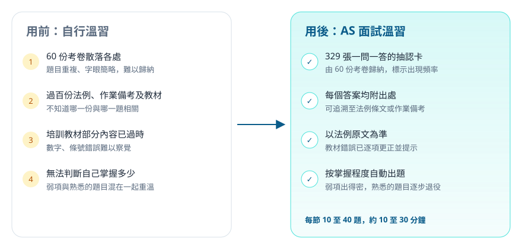
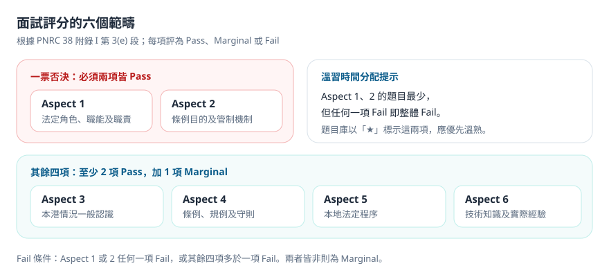
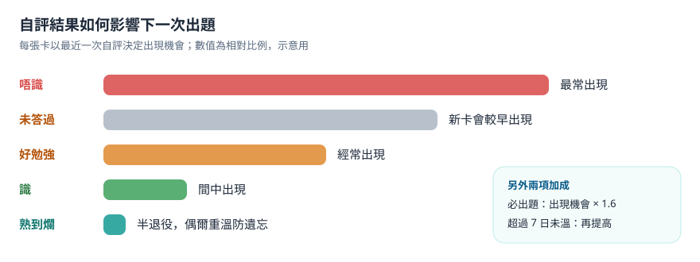

# 前言 {Introduction} {#intro}

## 產品簡介 {What It Is}

「AS 面試溫習」是一個網頁版的抽認卡（Flashcard）溫習工具，專為準備屋宇署獲授權簽署人（Authorized Signatory，AS）面試的同事而設。

**產品網址：[as-exam-training.vercel.app](https://as-exam-training.vercel.app/)**（需要帳號登入，見 [[#access]]）

題庫由過往 60 份考卷紀錄歸納而成，整理為 329 張一問一答的卡。每張卡的答案均附有出處，可追溯至法例、作業備考或屋宇署守則。系統會按你每次的自評結果調整出題次序：不熟悉的題目出得密，已熟記的題目逐步減少。

:::shot user-home.png | 主頁：顯示必出題與全庫的掌握進度、功能入口及合格準則
畫面：/；狀態：已登入，已完成兩節練習
:::

## 適用對象 {Who It Is For}

- 準備註冊專門承建商（地基工程）［RSC(Foundation)］AS 面試的同事。
- 準備註冊一般建築承建商（RGBC）AS 面試的同事。題庫包含上蓋專屬題目，可按需要納入。
- 每日只有十多二十分鐘，希望用零碎時間有系統地溫習的人。

本工具只供受邀用戶使用，帳號由產品擁有人開設。

## 關鍵名詞 {Key Terms}

| 名詞 | 意思 | 在哪裏見到 |
|---|---|---|
| AS | 獲授權簽署人（Authorized Signatory），代表註冊承建商就《建築物條例》事宜行事 | 全站 |
| RSC(F) | 註冊專門承建商（地基工程） | 設定、抽卡範圍 |
| RGBC | 註冊一般建築承建商 | 設定、抽卡範圍 |
| Aspect | 面試評分表的六個範疇，Aspect 1、2 為一票否決項 | 主頁、題目庫標籤 |
| 必出題 | 經人手確認、在考卷中高頻出現的題目，出題權重較高 | 卡片標籤、主頁進度 |
| 四級自評 | 看完答案後自評：「唔識」、「好勉強」、「識」、「熟到爛」 | 答題畫面 |
| 參考題 | 沒有標準答案的題目，例如公司意外率，只供提醒 | 題目庫 |
| 近兩年 % | 該題在最近 24 個月考卷中出現的比例 | 答案卡右上角 |

# 產品價值 {Why Use It} {#value}

## 解決的問題 {Pain Points}

準備 AS 面試時，一般會遇到四個困難：

1. **考卷紀錄零散。** 過往考卷由不同考生憑記憶寫下，字眼簡略、重複，難以歸納出「到底考甚麼」。
2. **參考資料過多。** 法例、規例、作業備考（PNAP、PNRC）及守則加起來超過一百份，難以判斷哪一份對應哪一題。
3. **教材內容有誤。** 坊間培訓教材有部分內容已經過時，例如條號已被新規例取代、罰款金額寫錯，考生很難自行察覺。
4. **無法掌握進度。** 溫習時熟悉與不熟悉的題目混在一起，花了時間重溫已經識的內容，弱項反而沒有溫到。

## 用前與用後 {Before & After}

## 使用場景 {Use Cases}

**日常溫習。** 每日開一節「加權混合」練習，20 題約需 15 分鐘。系統會自動把你答得不好的卡排得更前。

**面試前一至兩星期。** 改用「只練必出題」模式，集中處理高頻題目；配合主頁的必出題進度，確認全部達到「識」或「熟到爛」。

**臨面試前幾日。** 使用「專攻弱項」模式，只抽最近自評為「唔識」或「好勉強」的卡，逐一清除。

**碎片時間。** 在手機瀏覽器開啟，乘車或等候時做幾題；進度會自動同步到電腦。

# 使用前準備 {Before You Start} {#prepare}

## 所需條件 {Requirements}

- 電腦或手機，使用 Chrome、Edge 或 Safari 等現代瀏覽器。
- 穩定的網絡連線（本工具暫不支援離線使用）。
- 由產品擁有人開設的帳號。

## 如何進入 {Access} {#access}

1. 聯絡產品擁有人 Crimson，提供你用於登入的電郵地址。
2. 產品擁有人開設帳號後，會把一次性密碼**親手**交給你。系統不會寄出任何註冊電郵。
3. 打開網址 [as-exam-training.vercel.app](https://as-exam-training.vercel.app)，以電郵及該密碼登入。
4. 首次登入後，請立即到「設定」頁更改密碼（見 [[#settings]]）。

## 費用 {Cost}

免費。

# 開始使用 {Getting Started} {#getting-started}

## 登入系統 {Sign In} {#sign-in}

打開網址後會看到登入畫面。

1. 在「電郵」欄輸入你的電郵地址。
2. 在「密碼」欄輸入密碼。
3. 按「登入」。

:::shot user-login.png | 登入畫面
畫面：/；狀態：未登入
:::

:::check
登入後會直接進入「主頁」，左側為導航列，右上角有「登出」按鈕。
:::

:::warn 忘記密碼
系統沒有自助重設功能。請聯絡產品擁有人重設，你會收到新的一次性密碼。
:::

## 設定考科與考試日期 {Set Up Your Profile} {#setup}

首次登入時，系統會問你兩條問題：考哪一科，以及是否知道考試日期。兩者都只是預設值，之後可以在「設定」頁修改。

1. 選擇「地基（RSC Foundation）」或「一般建築（RGBC）」。這會決定預設抽卡範圍：選地基的話，上蓋專屬題目預設不會抽出。
2. 如已知道考試日期，選「知道」並填上日期；主頁會顯示倒數日數。不知道的話選「仲未知」，之後再補。
3. 按「開始溫習」。

如之後需要修改，到左側導航的「設定」：

:::shot user-settings.png | 設定頁：考試日期、改密碼及預設抽卡範圍
畫面：/settings；狀態：已填考試日期
:::

:::check
設定考試日期並按「儲存」後，會顯示「考試日期已儲存。」，主頁右側會出現倒數日數。
:::

## 認識主頁 {The Home Page} {#home}

主頁分為三部分：

1. **兩個進度圓圖。** 左邊是「必出題達標」，右邊是「所有題目」。「達標」的定義是最近一次自評為「識」或「熟到爛」。右邊另有四級自評的分佈。
2. **三個功能入口。** 「開始答題」、「回顧記錄」、「題目庫」。
3. **合格準則。** 列出面試評分表的六個範疇及合格條件。

:::tip
Aspect 1 及 2 的題目數量最少，但任何一項評為 Fail 即整體不合格。溫習時應優先處理這兩項，題目庫以「★」標示。
:::

## 選擇練習模式 {Choose a Practice Mode} {#practice}

按「開始答題」或左側導航的「答題」，進入練習設定。

1. **選擇方式。**
   - 「加權混合」：全部卡按掌握度加權抽出，日常首選。
   - 「只練必出題」：只抽經人手確認的必出題，適合面試前一至兩星期。
   - 「專攻弱項」：只抽最近自評為「唔識」或「好勉強」的卡。
2. **選擇題數。** 10 題、20 題或 40 題。一場真實面試約問 40 題，其中 15 至 20 題出自必出題。
3. **選擇抽卡範圍。** 考地基的同事可選擇是否包括上蓋（rgbc-only）的卡。
4. 按「開始（N 題）」。

:::shot user-practice.png | 練習設定：三種方式、題數及抽卡範圍
畫面：/practice；狀態：預設加權混合、20 題
:::

:::check
畫面切換至全屏答題模式，頂部顯示進度條及「01/10」之類的題號。
:::

## 作答與揭曉答案 {Answer and Reveal} {#reveal}

每張卡先只顯示題目，請**在心中完整作答**，再揭曉答案。

1. 閱讀題目，在心中或低聲說出你的答案。
2. 按「揭開答案」，或按鍵盤的空白鍵（Space）。

:::shot user-card-front.png | 題目正面：先作答，再揭曉答案
畫面：/session；狀態：第一張卡，未揭答案
:::

答案卡由上而下分為：本卡簡寫、答案、考生注意（中伏位）、出處，以及留意見的入口。答案卡右上角顯示「近兩年」出現比例。

:::shot user-card-answer.png | 答案卡：答案、近兩年出現比例及四級自評按鈕
畫面：/session；狀態：已揭答案
:::

:::check
答案下方出現四個顏色按鈕：「唔識」、「好勉強」、「識」、「熟到爛」。
:::

:::tip
答案以「考生對考官口述」的第一人稱寫成，可以直接照讀練習。表格則保留，方便記憶數字。
:::

## 誠實自評 {Rate Yourself} {#rate}

對照答案後，按實際表現選擇其中一級。桌面版可以用鍵盤數字鍵 1 至 4。

| 按鈕 | 何時選擇 |
|---|---|
| 唔識 | 答不出，或答錯關鍵內容 |
| 好勉強 | 大致方向正確，但漏了數字、條號或重點 |
| 識 | 答得完整，只有小瑕疵 |
| 熟到爛 | 可以流暢、完整地說出，包括數字和條號 |

你的選擇會決定這張卡日後出現的頻率：

:::warn 請誠實評分
自評偏高會令弱項卡太少出現，進度圓圖亦會失真。拿不準時，選較低的一級。
:::

## 查看節結報告 {Session Summary} {#summary}

完成一節所有題目後，會顯示節結報告。

1. 頂部顯示四級自評的數量。
2. 「今節要補返」列出你評為「唔識」或「好勉強」的卡，這些卡的權重已經自動調高。
3. 按「再嚟一節」繼續，或按「返主頁」查看最新進度。

:::shot user-session-summary.png | 節結報告：四級分佈及需要補溫的卡
畫面：/session 完成後；狀態：10 題一節
:::

:::check
返回主頁後，兩個進度圓圖的數字已經更新。
:::

# 進階功能 {Advanced Features} {#advanced}

## 題目庫與搜尋 {Question Bank}

「題目庫」讓你瀏覽全部題目及答案，不計入進度。

- **搜尋欄**可以搜尋題目、答案，連考官在考卷中的原本問法都能找到，例如輸入「BO 精神」。
- **評分範疇**按 Aspect 篩選，「★」代表一票否決項。
- **範疇**按 12 個知識範疇篩選，例如「地基工程」、「地盤安全」。
- 勾選「只睇必出題」可只顯示必出題。

:::shot user-bank.png | 題目庫：搜尋、評分範疇及知識範疇篩選
畫面：/bank；狀態：「有標準答案」分頁
:::

## 參考題 {Reference Questions}

題目庫的第二個分頁「參考題（冇標準答案）」收錄兩類題目：

1. **公司／個人特定題。** 例如「公司現時千人意外率？」。答案是你所屬公司的實際數字，題庫無法提供，請在考前向公司安全部門索取並記熟。
2. **未核實項目。** 官方原文未收錄、答案未能確定的內容。考官追問時，坦白表示會查證，比說出不肯定的數字更好。

這些題目不會在練習中抽出，亦不計入進度。

:::shot user-bank-reference.png | 參考題分頁：公司特定題及未核實項目
畫面：/bank；狀態：「參考題」分頁
:::

## 簡寫對照 {Abbreviations}

題目及答案經常出現簡寫，例如 RSE、TCP、BA14。你可以用三種方式查閱：

1. **本卡簡寫列。** 答題時，題目下方會列出本卡用到的簡寫；揭答案前只列題目中的簡寫，避免提早透露答案。
2. **就地查閱。** 文字下有虛線的簡寫，在桌面版滑鼠停留、在手機按一下，會彈出說明小卡。
3. **簡寫表頁面。** 左側導航的「簡寫表」收錄 248 條，可搜尋及按類別篩選。

:::shot user-glossary.png | 答題時的本卡簡寫列
畫面：/session；狀態：已揭答案，簡寫列展開
:::

:::shot user-glossary-page.png | 簡寫表：搜尋及九個分類
畫面：/glossary
:::

## 溫習記錄與弱項 {Records}

「記錄」頁顯示：

- 累計自評次數及接觸過的卡數。
- 最近 14 日每日的答題數量。
- 「弱項排行」：最近自評為「唔識」或「好勉強」的卡，可以作為下一節「專攻弱項」的參考。

:::shot user-records.png | 個人記錄：最近 14 日及弱項排行
畫面：/records；狀態：已完成兩節
:::

## 對答案提出意見 {Comment on an Answer} {#comment}

如果你認為某張卡的答案有問題，可以直接在答案卡底部留言，產品擁有人會收到並跟進。

1. 揭開答案後，捲動至答案卡底部，按「呢張卡有問題？留個意見」。
2. 選擇意見類別：「答案唔夠好」、「數字或條號信唔落」、「問法唔清楚」或「其他」。
3. 輸入具體內容，例如哪一個數字、你認為正確的出處。
4. 按「交意見」。

:::shot user-comment.png | 答案卡底部的意見框
畫面：/session；狀態：已揭答案，意見框已展開並填寫示範文字（未提交）
:::

:::check
提交後，該卡下次出現時會顯示「（你之前留過）」。
:::

## 個人設定 {Settings} {#settings}

左側導航的「設定」頁可以：

- 修改或清除考試日期。
- 更改密碼（最少 10 個字元）。首次登入後請立即更改。
- 更改預設抽卡範圍（地基或一般建築）。

## 加至手機主畫面 {Add to Home Screen}

在手機瀏覽器打開網址並登入後，可以把網頁加至主畫面，之後像應用程式一樣開啟：

- **iPhone（Safari）：** 按分享按鈕，選「加入主畫面」。
- **Android（Chrome）：** 按右上角選單，選「加到主畫面」。

登入狀態會保留，無需每次重新登入。

:::shot user-home-mobile.png | 手機版主頁
畫面：/；viewport 390×844；狀態：已登入
:::

# 疑難排解 {Troubleshooting} {#troubleshooting}

## 常見問題 {FAQ}

**問：為甚麼同一題經常出現？**

答：你最近對該題的自評可能是「唔識」或「好勉強」，系統會提高它的出現機會。當你評為「識」或「熟到爛」後，出現次數會明顯減少。另外，必出題的出現機會本身較高。

**問：必出題是怎樣決定的？**

答：先按題目在 60 份考卷中的出現頻率篩選，再由產品擁有人逐題人手確認。系統本身不會自行把題目設為必出題。

**問：答案與我在培訓班學到的不同，應該相信哪一個？**

答：題庫以法例原文及屋宇署官方文件為準。部分培訓教材已經過時或有錯漏，答案卡的「考生注意」會提示已知的分歧。如仍有疑問，請使用 [[#comment]] 留言。

**問：可以離線使用嗎？**

答：暫時不可以。答題及自評需要網絡連線才能儲存。

**問：我考地基，為甚麼題目庫會見到上蓋的題目？**

答：題目庫顯示全部題目以供參考，但練習時預設不抽上蓋專屬的卡。你可以在練習設定的「抽卡範圍」自行納入。

## 出錯時的處理 {When Things Go Wrong}

| 現象 | 可能原因 | 處理方法 |
|---|---|---|
| 登入時顯示密碼錯誤 | 密碼輸入錯誤，或已被重設 | 確認大小寫；仍然失敗請聯絡產品擁有人重設 |
| 主頁數字沒有更新 | 自評未能即時上傳 | 重新整理頁面；系統會在下次開啟時自動補交未上傳的自評 |
| 選「專攻弱項」時顯示沒有卡 | 你暫時沒有自評為「唔識」或「好勉強」的卡 | 先用「加權混合」完成幾節 |
| 手機上看不到左側導航 | 手機版把導航收在選單內 | 按左上角的「☰」按鈕 |
| 登入後每次都要求重新設定 | 設定未能儲存 | 重新整理後再試一次；如持續出現，請聯絡產品擁有人 |

# 意見反饋 {Feedback} {#feedback}

**對題目或答案有意見：** 請直接在答案卡底部留言（見 [[#comment]]）。系統會記錄是哪一張卡、由哪一個帳號提出，處理起來最快。

**對這份指南有意見：** 例如步驟寫得不清楚、截圖與實際畫面不符，請電郵至 ，或按頁面右下角的「對本節有意見」按鈕，系統會自動填上章節編號。

一般會在三個工作天內回覆。
