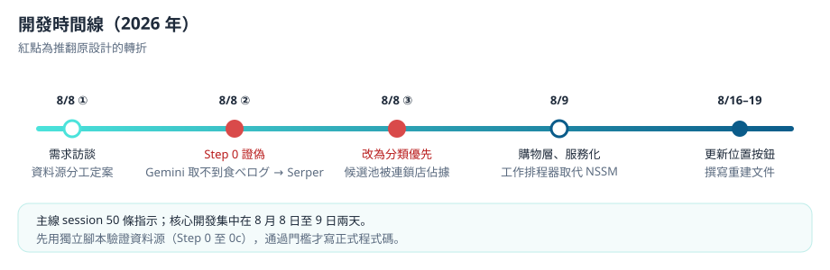
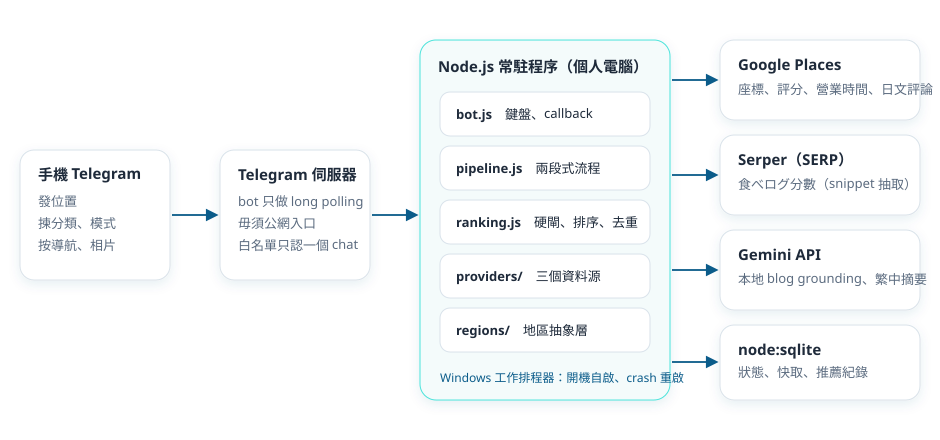
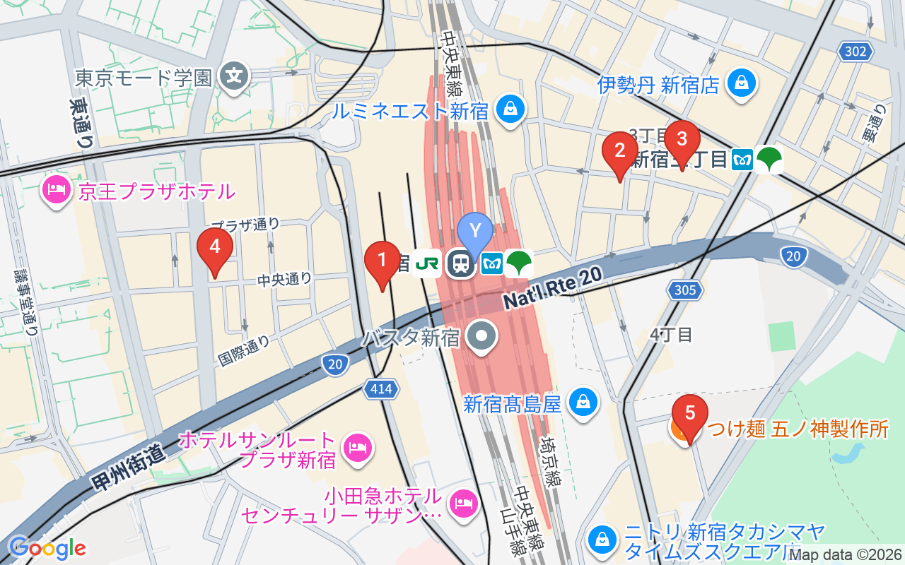
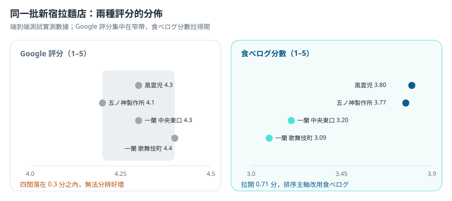
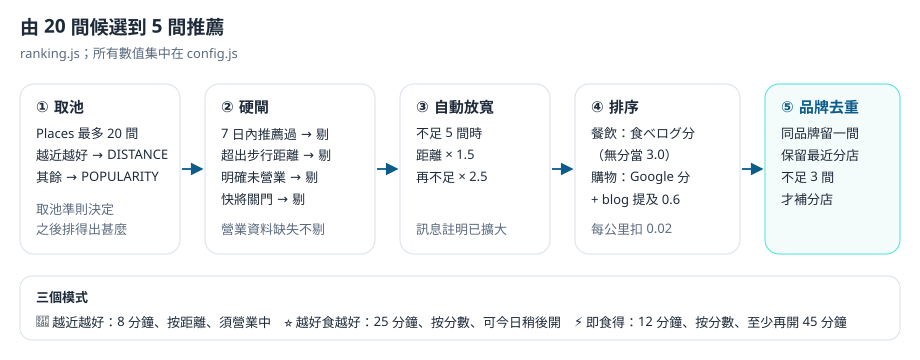
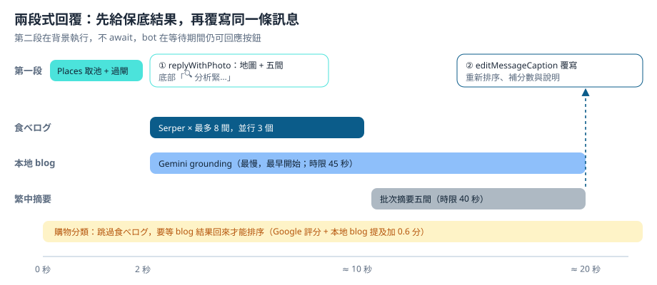

# 緣起 {Origin} {#origin}

## 構思起點 {The Spark}

Crimson Lau（CKW Group）機緣巧合下想做一個日本旅行時用的即時指引工具：人在街頭，發一個位置，就知道附近值得去的店。

最初的要求只有三條原則：遠近、評分或熱門程度、營業時間；輸入輸出都在 Telegram，回覆要有圖片、地點連結及文字。

需求訪談期間，真正的問題浮現出來：**Google 評分在日本餐飲上幾乎沒有分辨力。** 同一區的好店與遊客店都是 4.3 分。日本本地人參考的是食べログ（Tabelog），但它沒有 API，亦禁止抓取。整個產品於是變成一個問題：怎樣在合規的前提下，用食べログ做排序主軸。

本產品是私人自用工具，只接受一個 Telegram 帳號，不對外開放。

## 要解決的問題 {Problem}

1. **評分失真。** 同一區拉麵店的 Google 評分全部落在 4.1 至 4.4，食べログ分數卻拉開到 3.09 至 3.80（見 [[#logic-score]]）。
2. **候選池被連鎖店佔據。** 不指定分類時，新宿 600 公尺內頭十間有八間是壽司郎、一蘭、麥當勞、薩莉亞一類。
3. **街頭等不起。** 所有資料源加起來要二十秒，但人站在路口，兩秒內就要看到東西。
4. **遊客陷阱。** 很多 `.jp` 網站其實專寫給外國遊客，推薦的正是遊客店，必須分辨真正的本地來源。

## 範圍 {Scope}

| 做 | 刻意不做 |
|---|---|
| 分類優先：先揀拉麵、藥妝等分類，再查 | **爬食べログ頁面**：店舖頁回 `403`，使用條款明文禁止複製及保管 |
| 三個模式：越近越好、越好食越好、即食得 | **食べログ評語全文**：只讀分數；評語分析改用 Google Places 的日文評論 |
| 兩段式回覆：2 秒快名單，約 20 秒後補分數及說明 | **雲端備援**：電腦停電或斷網即不可用，評估後認為不值得另寫雲端版 |
| 本地 blog 補充，並分辨遊客媒體 | **多用戶**：白名單只認一個 chat ID |
| 同品牌去重、7 日內不重複推薦 | **自動更新位置**：不做 Live Location、位置過期提示或 GPS 精度警告，由用戶手動按「更新位置」 |
| 開機自動啟動、crash 自動重啟 | **儲存店舖相片**：Google 條款不准，每次即時取 |

# 工具與成本 {Tools & Cost} {#tools-cost}

## AI Agent 與模型 {Agent & Models}

| 項目 | 用途 |
|---|---|
| Claude Code（桌面版） | 需求訪談、資料源驗證腳本、全部程式碼、服務化腳本、部署指引 |
| Skill：grilling | 逐條訪談需求，建立設計決策紀錄 `docs/DECISIONS.md` |
| Skill：rebuild-doc | 開發完成後產出重建指南 `REBUILD.md`，本頁逐步教學以此為基礎 |
| Gemini Flash（產品內） | 本地 blog 搜尋（grounding）及繁體中文摘要 |

## 開發工具 {Dev Tools}

| 工具 | 用途 | 收費 |
|---|---|---|
| Node.js 24（要求 22 以上） | Runtime；需要內建的 `node:sqlite` 及 `process.loadEnvFile()` | 免費 |
| grammY | Telegram bot 框架 | 免費 |
| `@google/genai` | Gemini SDK | 免費 |
| Windows 工作排程器、PowerShell 5.1 | 常駐服務 | 系統內建 |

## 第三方服務 {Services}

| 服務 | 用途 | 收費 |
|---|---|---|
| Google Places API (New) | 座標、距離、Google 評分、營業時間、日文評論 | 需綁信用卡；免費額度內不扣款 |
| Maps Static API | 地圖圖片 | 同上 |
| Serper.dev | 讀取 Google 搜尋結果，抽食べログ分數 | 註冊送 2,500 次，不需信用卡；之後最低 US$50（50,000 次，6 個月到期） |
| Gemini API（Google AI Studio） | blog grounding、摘要 | 免費額度；但 key 所屬專案必須已接 billing account |
| Telegram Bot API | 輸入輸出 | 免費 |

## 開發成本 {Build Cost}

- **AI：** Claude 訂閱，沒有額外 API 費用。
- **時間：** 核心開發集中在 2026 年 8 月 8 日至 9 日；8 月 16 日至 19 日加入「更新位置」按鈕並撰寫重建文件。按重建指南估算，同類工具約需 6 至 10 小時。

:::gap
開發時數由 session 日期推算，未有精確工時紀錄。
:::



## 運作成本 {Running Cost}

| 項目 | 免費額度 | 個人旅行用量 | 實付 |
|---|---|---|---|
| Places（Enterprise + Atmosphere） | 1,000 次／月 | 少於 300 | US$0 |
| Maps Static | 10,000 次／月 | 少於 300 | US$0 |
| Place Photo | 按次計費（每 1,000 次約 US$7） | 少於 100 | 約 US$0 |
| Gemini Flash | 1,000 次／日 | 遠低於 | US$0 |
| Gemini grounding | 5,000 次／月 | 約 1,800 | US$0 |
| Serper | 一次性 2,500 次 | 每次查詢約 6 次 | US$0（約夠三四趟旅行） |

**每月 US$0。** 真正的門檻不是錢，而是要開一個綁卡的 Google Cloud 帳戶。

:::warn 免費額度會變動
以上為 2026 年 8 月的情況，請以各服務官方頁面為準。
:::

# 技術架構 {Architecture} {#architecture}

## 系統總覽 {Overview}



bot 以 long polling 向 Telegram 取訊息，所以跑在個人電腦上即可，不需要公網入口。每次查詢：

1. 用戶在 Telegram 發位置、揀分類。
2. `pipeline.js` 第一段向 Places 取 20 間候選，過閘後立即回覆地圖及五間店。
3. 第二段在背景向 Serper 查食べログ分數、向 Gemini 找本地 blog 及寫摘要，完成後覆寫同一條訊息。
4. 所有結果按資料源分別快取在 `node:sqlite`。



## 後台技術 {Backend & IT} {#backend}

**技術棧**

| 層 | 用甚麼 | 為甚麼 |
|---|---|---|
| Runtime | Node.js 22 以上 | 內建 `node:sqlite` 及 `process.loadEnvFile()`，免安裝額外套件 |
| Telegram | grammY + long polling | inline keyboard 與 callback query API 直觀；long polling 毋須公網 HTTPS |
| 地點資料 | Google Places API (New) | 唯一能一次取得座標、營業時間、評分及日文評論的來源，一個請求回 20 間只計一次費 |
| 本地評分 | Serper.dev | 食べログ沒有 API 且封鎖抓取，但分數會出現在搜尋結果 snippet |
| 本地 blog、摘要 | Gemini API | `google_search` grounding 能找到日本本地 blog；同一個 key 兼做摘要 |
| 儲存 | `node:sqlite` | Node 內建，零原生編譯；換機或升級 Node 不會出現原生模組編譯失敗 |
| 常駐 | Windows 工作排程器 | 系統內建，不需下載第三方 binary |

**檔案樹**

```text
Tour-Guide/
├── index.js                進入點：chdir、載入環境變數、連線重試、long polling、409 退避
├── .env.example            key 欄位範本（.env 不入版控）
├── docs/DECISIONS.md       設計決策紀錄
├── scripts/
│   ├── step0b-serper-tabelog-test.mjs   資料源驗證：Serper 抽食べログ分數
│   ├── step0c-e2e-test.mjs              端到端驗證：Places → Serper → 身分驗證
│   ├── run-bot.cmd                      服務啟動器（負責輸出重新導向）
│   ├── install-service.ps1              註冊開機自啟服務
│   └── uninstall-service.ps1
└── src/
    ├── config.js           分類、三個模式、距離閘、快取 TTL
    ├── db.js               使用者狀態、快取、推薦紀錄
    ├── logger.js           檔案日誌（每日一檔，保留 14 日）
    ├── ranking.js          硬閘、排序、自動放寬、同品牌去重
    ├── pipeline.js         兩段式流程；餐飲與購物分流
    ├── format.js           訊息版式與長度降級
    ├── bot.js              白名單、鍵盤、callback、背景第二段
    ├── place-types.js      Places 類型 → 繁中標籤（說明的保底）
    ├── providers/          places.js、tabelog.js、gemini.js
    └── regions/            index.js（註冊表）、japan.js（日本實作）
```

**正規化店舖物件**（`providers/places.js` 產生，全程通用）

```js
{
  id, name, address, lat, lng,
  distanceMetres, walkMinutes,
  googleRating, googleRatingCount, priceLevel,
  typeCode,        // Places 英文枚舉，例如 'ramen_restaurant'
  typeLabel,       // Places 日文顯示名
  mapsUri,
  openNow,         // true / false / null（資料不齊時為 null）
  periods, weekdayHours,
  reviews          // 只保留日文評論：[{ text, rating }]
}
```

**RegionProvider 介面**（`regions/japan.js` 實作）

```js
{
  id, label, languageCode, regionCode, timezone, scoreSourceName,
  contains({ lat, lng }),                           // 座標是否屬於這個地區
  scoreAppliesTo(category),                         // 本地權威評分覆蓋哪些分類
  buildScoreQuery({ name, ward, town }),
  buildBlogQuery({ name, ward }),
  isLocalSource({ url, domain, title, snippet }),   // 本地來源判定
  parseAddress(address),                            // → { ward, town, chome }
  parseScoreUrl(url),                               // → { prefecture, majorArea, minorArea, shopId }
  isDefunct(text)                                   // 已結業判定
}
```

**資料表**（`db.js`）

| 表 | 內容 |
|---|---|
| `user_state` | chat_id 主鍵、上次模式、上次分類、上次座標 |
| `cache` | key、來源、JSON payload、到期時間 |
| `recommendations` | (chat_id, place_id) 複合主鍵、推薦時間、去過時間 |

快取 TTL：Places 資料 7 日（條款上限 30 日）、食べログ分數 24 小時（刻意壓到最短）、blog 3 日。

**外部接口**

| 服務 | 端點 | 重點 |
|---|---|---|
| Places 附近搜尋 | `POST https://places.googleapis.com/v1/places:searchNearby` | 標頭 `X-Goog-Api-Key`、`X-Goog-FieldMask`；body 用 `includedPrimaryTypes` |
| Places 文字搜尋 | `POST https://places.googleapis.com/v1/places:searchText` | `rankPreference` 只接受 `RELEVANCE` 或 `DISTANCE` |
| Places 相片 | `GET https://places.googleapis.com/v1/{photoName}/media` | 不准儲存，即取即用 |
| 靜態地圖 | `GET https://maps.googleapis.com/maps/api/staticmap` | `markers` 可重複，每個一組 pin |
| 導航連結 | `https://www.google.com/maps/dir/?api=1&destination=…` | 免費，不需要 key |
| Serper | `POST https://google.serper.dev/search` | 標頭 `X-API-KEY`；body `{ q, gl: 'jp', hl: 'ja', num }` |
| Gemini | `POST https://generativelanguage.googleapis.com/v1beta/models/{model}:generateContent` | 標頭 `x-goog-api-key`；grounding 用 `tools: [{ google_search: {} }]` |

**Places field mask 計費規則**（影響整個設計）

按 field mask 中**最貴的欄位**計費：

- Essentials／Pro：`id`、`location`、`formattedAddress`、`displayName`、`googleMapsUri`
- Enterprise：`rating`、`userRatingCount`、`regularOpeningHours`、`priceLevel`
- Enterprise + Atmosphere：`reviews`

所以加了 `rating` 之後，營業時間是免費順手取得；評論在搜尋請求中一併取回（一次呼叫），比逐間呼叫 Place Details（五次）便宜五倍。

## AI 技術 {AI Techniques} {#ai}

### 本地 blog 搜尋 {Local Blog Grounding}

Gemini 的 `google_search` grounding 負責找日本本地 blog。流程：

1. prompt 全日文，使用分類的日文關鍵詞（`category.ja`），例如「新宿区 ラーメン」。
2. 先要求模型搜尋並自由說明，**在「回答の最後に」才要求逐行輸出** `STORE=<店名> | REASON=<理由>`。
3. 取 `groundingMetadata.groundingChunks` 的來源，經本地來源判定過濾（見 [[#logic-local]]）。
4. 一個本地來源都沒有時，當作查不到。blog 層可以完全無效，不影響主排序。

### 批次繁中摘要 {Batch Summaries}

五間店一次過送去 Gemini，每間回一句 25 字以內的繁體中文說明，不開 grounding（資料已在 prompt 內）。三層保底：

| 情況 | 顯示 |
|---|---|
| 正常 | 由日文評論寫成的具體說明 |
| 沒有日文評論 | 由店名與業種描述店舖類型 |
| Gemini 逾時或 503 | 由 `primaryType` 對照的繁中類型標籤（例如「藥妝店」） |
| 類型亦未知 | 日文原類型名，最後退到「店舖」 |

### 兩個令 grounding 靜靜失效的陷阱 {Grounding Pitfalls}

| 陷阱 | 現象 | 處理 |
|---|---|---|
| prompt 一開頭強制固定格式（「説明文は不要」） | 模型完全不呼叫搜尋工具，憑記憶作答，數字看似真實 | 先要求搜尋，格式要求放最後；檢查 `groundingChunks` 及 `webSearchQueries` 是否為空 |
| 日文 prompt 夾雜中文分類名 | 搜尋工具不啟動 | 每個分類獨立一個 `ja` 欄位 |

此外，Gemini 延遲波動很大：grounding 實測 20 至 35 秒，偶爾超過 70 秒。時限設為搜尋 45 秒、摘要 40 秒，收到 429 或 503 時退避重試最多三次。

## 核心邏輯 {Core Logic}

### 食べログ分數抽取 {Tabelog Score Extraction} {#logic-score}



食べログ沒有 API，但分數會出現在 Google 搜尋結果的 snippet。抽取流程：

1. **查詢詞：** `site:tabelog.com <店名> <区><町> 総合得点`。加「総合得点」後，Google 會挑含分數的段落做 snippet，才能取得兩位小數。
2. **抽分數：** 優先抓「総合得点 3.83」這種帶標籤的兩位小數，其次任何 `[2-4].dd`，最後才用 Serper 的 `rating` 欄位（只有一位小數，標記為不精確）。
3. **身分驗證：** 逐個結果檢查，第一個通過的就用：
   - 含「【閉店】」「閉店しております」「【移転】」→ 跳過
   - URL 不是店舖頁（`^https://tabelog\.com/(en/)?[a-z]+/A\d+/A\d+/\d+/?$`）→ 跳過
   - 都道府縣與預期不同 → 跳過
   - snippet 有地址就比對「区市」，沒有地址才正規化比對店名
4. **一致性檢查：** 同一次查詢的店都在同一區，統計多數派都道府縣，剔走少數派結果。
5. **快取：** 查不到也用 `null` 寫入快取，避免同一間店重複消耗 credit；網絡或額度錯誤則不寫。

驗證結果：端到端測試可用率 90%，兩位小數比例 6/6。

### 排序與硬閘 {Ranking & Gates} {#logic-ranking}



三個細節：

- **取池準則跟隨模式。** Places 只回 20 間，用甚麼準則取池，直接決定之後排得出甚麼。中野 1,200 公尺範圍實測：用 `POPULARITY` 取池，500 公尺內只有 7 間、最近 184 公尺；用 `DISTANCE` 取池，500 公尺內有 19 間、最近 95 公尺。所以「越近越好」必須用 `DISTANCE`。
- **沒有最低分數閘。** 沒有食べログ分數的店照出並以 3.0 計算，很多新店及本地小店未有分數。
- **營業資料缺失不懲罰。** `openNow` 為 `null` 時不剔除。

步行時間 = 直線距離 × 1.25（街道繞行係數）÷ 每分鐘 80 公尺。

### 本地來源判定 {Local Source Detection} {#logic-local}

`japan.js` 的 `isLocalSource()` 依次判斷：

| 次序 | 規則 | 結果 |
|---|---|---|
| 1 | 遊客媒體黑名單：`livejapan.com`、`matcha-jp.com`、`tsunagujapan.com`、`japantravel.com`、`japan-guide.com`、`tripadvisor`、`klook.com`、`kkday.com` | 不是本地 |
| 2 | 本地 blog 平台：`note.com`、`hatenablog.com`、`hatenablog.jp`、`ameblo.jp`、`livedoor.jp`、`fc2.com`、`exblog.jp`、`goo.ne.jp`、`supleks.jp` | 本地，並加分 |
| 3 | `.jp` 域名 | 本地 |
| 4 | 文字足夠長且假名比例超過 5% | 本地 |
| 5 | 其他 | 無法確認，剔除 |

:::warn `.jp` 不等於本地人所寫
日本有大量 `.jp` 媒體專門寫給外國遊客，推薦的正是遊客店。所以黑名單必須排在 `.jp` 規則之前。
:::

### 同品牌去重 {Brand Dedupe} {#logic-dedupe}

- 品牌由店名推斷：剝走最後一個以「店」結尾的空白分隔詞（「ドン・キホーテ 新宿東南口店」→「ドン・キホーテ」）。名字沒有空白就用全名，寧願漏去重，也不要把兩間不同的店當成同一品牌。
- 同品牌只留一間，佔該品牌的最高排名位置，但**保留最近的分店**：連鎖分店質素相同，距離才是差別。
- 去重後不補到滿，只有少於 3 間才補回分店。四個真實選擇好過五個有重複的選擇。

### 兩段式回覆 {Two-Stage Reply} {#logic-two-stage}



- 第一段用 `replyWithPhoto` 發地圖及名單，caption 底部顯示「🔍 分析緊…」。
- 第二段**不可 `await`**，改為呼叫獨立背景函式，完成後以 `editMessageCaption` 覆寫同一條訊息。
- 第二段失敗時保留第一段結果，只在末尾註明深度分析失敗。
- Telegram 圖片 caption 上限 1,024 字元，超出會整條發送失敗。降級次序：先刪 blog 行，再減店數，**說明行永不刪除**。

:::shot dev-telegram-stage1.png | 第一段：地圖及候選名單，底部顯示分析中；原範圍不足，已自動放寬至 20 分鐘
實際使用畫面（東京日本橋、越近越好模式）
:::

:::shot dev-telegram-stage2.png | 第二段：同一條訊息補上食べログ分數、繁中說明及本地 blog 另外提到的店
約 20 秒後的同一條訊息
:::

### 分類搜尋策略 {Category Strategies} {#logic-categories}

Places 有些分類有原生類型，有些沒有；兩種策略收費同級。以下為東京新宿、中野一帶實測結果：

| 分類 | 策略 | 參數 | 候選池質素 |
|---|---|---|---|
| 🍜 拉麵 | Nearby | `ramen_restaurant` | 優 |
| 🍣 壽司 | Nearby | `sushi_restaurant` | 中（連鎖偏多） |
| 🥟 中華 | Nearby | `chinese_restaurant` | 優 |
| ☕ 咖啡 | Nearby | `cafe`、`coffee_shop` | 優（老派喫茶店會浮上） |
| 🍝 西餐 | Nearby | `italian_restaurant`、`french_restaurant`、`western_restaurant`、`steak_house` | 未測 |
| 🍔 快餐 | Nearby | `fast_food_restaurant` | 未測 |
| 🍢 居酒屋 | Text | `居酒屋` | 優 |
| 🍖 燒肉 | Text | `焼肉` | 優（Google 分普遍 4.9，靠食べログ校正） |
| 🍤 天婦羅 | Text | `天ぷら` | 優 |
| 🍱 定食 | Text | `和食 定食` | 優 |
| 💊 藥妝 | Nearby | `drugstore`、`pharmacy` | 優（本地平價藥妝浮上） |
| 👕 服飾 | Nearby | `clothing_store`、`shoe_store` | 中（連鎖偏多） |
| 🎮 電器 | Nearby | `electronics_store` | 優 |
| 📚 書店 | Nearby | `book_store` | 優 |
| 🛒 超級市場 | Nearby | `supermarket`、`grocery_store` | 優（配合 DISTANCE 取池） |
| 🏠 生活雜貨 | Text | `生活雑貨 インテリア 雑貨店` | 優 |
| 🎁 手信 | Text | `お土産` | 優 |
| 👘 古着二手 | Text | `古着` | 優 |
| 🏪 激安折扣 | Text | `激安 ディスカウントストア` | 優 |
| 🎌 動漫 | Text | `アニメショップ` | 優 |

**不要用的類型：**

- `japanese_restaurant` 太闊，結果與不分類無異。
- `bar`、`pub` 不等於居酒屋，實測回賽馬投注站、卡拉 OK、live house。
- `home_goods_store` 在新宿被相機店佔據（見 [[#journal-types]]）。

### 地區抽象層 {Region Abstraction} {#logic-region}

所有日本專屬知識（權威評分來源、本地來源判定、查詢語言、地址格式）收在 `regions/japan.js`。`resolveRegion()` 對不支援的座標回 `null`，不會 fallback 到日本，否則在台灣查會拿到食べログ結果。加台灣或韓國只需新增一個同介面的檔案。

:::note 為何值得做抽象層
地區差異不只是換字串：權威評分來源、本地來源判定方式、查詢語言、地址格式四樣都不同，抽象層才有實質價值。如果差異只是介面語言，i18n 已經足夠。
:::

# 逐步教學 {Build Step-by-Step} {#build}

以下是重建同類 bot 的最短路徑，步驟已重新排序；實際過程的轉折見 [[#journal]]。每步的指令可以直接貼給 AI agent。

## 階段一：資料源驗證 {Phase 1: Validate Data Sources}

完成後，你會證實食べログ分數真的抽得到。整個產品的排序主軸壓在這個假設上，所以先驗證再動手。

### 建立專案骨架 {#step-skeleton}

:::prompt Step 1 指令
在新資料夾建立 Node.js 專案骨架：
1. package.json：name tour-guide、"type": "module"、"private": true、engines.node ">=22"，暫時不加 dependencies
2. .gitignore：node_modules/、.env、*.log、data/、logs/
3. .env.example：GEMINI_API_KEY、SERPER_API_KEY、GOOGLE_MAPS_API_KEY、TELEGRAM_BOT_TOKEN、TELEGRAM_ALLOWED_CHAT_ID，每個上面一行註釋說明去哪裏取得
不要建立 src/ 下任何檔案。
:::

:::check
- `package.json`、`.gitignore`、`.env.example` 存在。
- `node -e "console.log(process.version)"` 印出 v22 或以上。
:::

### 取得三個 API key {#step-keys}

依次申請 Serper.dev（不需信用卡）、Google AI Studio（Gemini）、Google Maps Platform（啟用 Places API (New) 及 Maps Static API，並限制 key 只能用這兩個 API），填入 `.env`。

:::check
```bash
node -e "process.loadEnvFile('.env'); for (const k of ['GEMINI_API_KEY','SERPER_API_KEY','GOOGLE_MAPS_API_KEY']) console.log(k, process.env[k] ? '已填' : '未填')"
```
三條 key 都顯示「已填」。
:::

:::warn Gemini key 回 `401 API_KEY_SERVICE_BLOCKED`
AI Studio 新發的 key 為 `AQ.` 開頭，舊的 `AIza` 格式亦一樣，**都用 `x-goog-api-key` 標頭，不要用 `Authorization: Bearer`**。收到這個錯誤，成因不是傳送方式，而是 key 所屬專案綁定了服務帳戶，或未接 billing account。修改 API 限制或按「啟用」都無效，唯一做法是換一條屬於已接 billing 專案的 key。
:::

:::gap
三個服務的註冊點擊流程會改版，本頁未逐步記錄。
:::

### 驗證 Serper 抽得到食べログ分數 {#step-serper-test}

:::prompt Step 3 指令
建立 scripts/step0b-serper-tabelog-test.mjs：
1. process.loadEnvFile('.env') 讀 SERPER_API_KEY
2. 內建 10 間真實日本餐廳（店名 + 地區），分 famous / known / obscure 三個知名度
3. 每間發 POST https://google.serper.dev/search，標頭 X-API-KEY，body { q, gl: 'jp', hl: 'ja', num: 10 }
   查詢詞：site:tabelog.com <店名> <地區> 総合得点
4. 抽分數：優先「総合得点 3.83」，其次任何 [2-4].dd，最後才用 rating 欄位；抽評論數「口コミ 1,315 件」
5. 身分驗證：只認店舖頁 URL ^https://tabelog\.com/(en/)?[a-z]+/A\d+/A\d+/\d+/?$；排除「【閉店】」「閉店しております」；店名去空白後雙向包含
6. 逐間印出 title 及 snippet 原文
7. 最後印出命中率、兩位小數比例、按知名度拆分的命中率
package.json 加 script step0b。
:::

:::check
`npm run step0b` 命中率 **≥ 70%**，兩位小數比例接近 100%。低於 70% 不要繼續往下建。
:::

:::warn 查詢詞一定要加「総合得点」
不加的話，Google 多數挑地址或營業時間做 snippet，只能取得 `rating` 欄位的一位小數。3.57 與 3.52 差很遠，四捨五入後分不開，排序主軸等於報廢一半。
:::

### 驗證端到端資料鏈 {#step-e2e}

:::prompt Step 4 指令
建立 scripts/step0c-e2e-test.mjs：
1. 命令列參數：緯度、經度、半徑（預設 35.6896, 139.7006, 600）
2. POST https://places.googleapis.com/v1/places:searchNearby 取候選
   FieldMask：places.id, displayName, formattedAddress, location, rating, userRatingCount, primaryTypeDisplayName, currentOpeningHours.openNow
   body：includedPrimaryTypes 餐飲類型、maxResultCount 20、languageCode 'ja'、regionCode 'JP'、rankPreference 'POPULARITY'
3. 取前 10 間，用 Step 3 方式查食べログ分數
4. 身分驗證改用地址：寫日本地址解析函式，把「〒160-0022 東京都新宿区新宿３丁目３４−１１」解析為 { ward: '新宿区', town: '新宿', chome: 3 }（先把全形數字轉半形）；snippet 沒有地址時才比對店名
5. 印出可用率、錯配數、兩位小數比例
6. 最後印出「以食べログ重排的前五間」，與 Google 排序對照
package.json 加 script step0c。
:::

:::check
- `npm run step0c` 可用率 **≥ 70%**。
- 重排後名單與 Google 排序**明顯不同**。看不到這種差距，後面所有工作都沒有意義。
:::

:::note 為何讀 SERP snippet，而不直接抓食べログ
官方 API 已於 2014 年停止，店舖頁直接請求回 `403`，使用條款禁止複製及保管。讀取公開搜尋結果的 snippet，只使用已公開索引的摘要，不接觸目標網站，也不儲存原始頁面。適用條件：目標資料必須會出現在 snippet 中——分數與評論數會，評語全文不會。
:::

## 階段二：骨架與地區抽象層 {Phase 2: Skeleton}

完成後，專案有設定檔、地區抽象層及本機儲存。

### 設定檔 {#step-config}

:::prompt Step 5 指令
建立 src/config.js，匯出：
1. walkingMetresPerMinute = 80
2. modes：near（8 分鐘、sortBy distance、需要營業中）、best（25 分鐘、sortBy score、不要求營業中）、now（12 分鐘、sortBy score、需要營業中且至少再開 45 分鐘）；每個有 id / emoji / label / labelShopping / walkMinutes / sortBy / requireOpenNow / minMinutesBeforeClosing
3. defaultModeId 'best'；distanceRelaxSteps [1.5, 2.5]
4. categories：食嘢 10 個、購物 10 個，每個有 id / group / emoji / label / ja / strategy，nearby 用 types、text 用 query（清單見「分類搜尋策略」一節）。ja 欄位必填
5. search = { poolSize: 20, tabelogLookupCount: 8, resultCount: 5 }
6. cacheTtl = { placeData: 7 天, tabelog: 24 小時, blog: 3 天 }（秒）
7. dedupeDays = 7
8. getCategory(id)、getCategoriesByGroup(group)、modeLabel(mode, category)
:::

:::check
```bash
node -e "import('./src/config.js').then(c => console.log('食', c.getCategoriesByGroup('food').length, '購物', c.getCategoriesByGroup('shopping').length))"
```
輸出 `食 10 購物 10`。
:::

### 地區抽象層 {#step-region}

:::prompt Step 6 指令
建立 src/regions/japan.js 及 src/regions/index.js。
japan.js 匯出 japanProvider：id 'jp'、label '日本'、languageCode 'ja'、regionCode 'JP'、timezone 'Asia/Tokyo'、scoreSourceName '食べログ'，以及：
- contains({lat,lng})：lat 24–46、lng 122–146
- scoreAppliesTo(category)：category.group === 'food'
- buildScoreQuery({name,ward,town})：site:tabelog.com <name> <ward><town> 総合得点
- buildBlogQuery({name,ward})：<name> <ward> 感想 ブログ
- isLocalSource：遊客媒體黑名單 → 否；本地 blog 平台 → 是並加分；.jp → 是；假名比例 > 5% → 是；其他 → 無法確認（清單見「本地來源判定」一節）
- parseAddress、parseScoreUrl、isDefunct
index.js 匯出 resolveRegion（找不到回 null，不要 fallback 到日本）、getRegionById、supportedRegions。
:::

:::check
```bash
node -e "import('./src/regions/index.js').then(r => { const jp = r.resolveRegion({lat:35.6896,lng:139.7006}); console.log(jp?.label, r.resolveRegion({lat:25.03,lng:121.56}), JSON.stringify(jp.parseAddress('〒160-0022 東京都新宿区新宿３丁目３４−１１'))) })"
```
輸出 `日本 null {"ward":"新宿区","town":"新宿","chome":3}`。
:::

### 本機儲存 {#step-db}

:::prompt Step 7 指令
建立 src/db.js，用 Node 內建 node:sqlite（不要用 better-sqlite3）：
1. 資料庫 data/tour-guide.db，自動建立資料夾；PRAGMA journal_mode = WAL
2. 三張表：user_state、cache（key、source、payload、expires_at，並為 expires_at 及 source 建 index）、recommendations（(chat_id, place_id) 複合主鍵、name、recommended_at、visited_at）
3. 函式：cacheGet（過期或 JSON 解析失敗就刪除並回 null）、cacheSet、cachePurgeExpired、getUserState、saveUserState、recordRecommendations、getRecentlyRecommended、markVisited
:::

:::check
`data/tour-guide.db` 出現；寫入一筆狀態及快取後讀回正常。
:::

## 階段三：資料層 {Phase 3: Data Providers}

完成後，可在命令列印出五間店連食べログ分數及繁中說明。

### Places provider {#step-places}

:::prompt Step 8 指令
建立 src/providers/places.js：
1. FIELD_MASK：places.id, displayName, formattedAddress, location, rating, userRatingCount, priceLevel, primaryType, primaryTypeDisplayName, googleMapsUri, currentOpeningHours.openNow, currentOpeningHours.periods, regularOpeningHours.weekdayDescriptions, reviews
2. haversineMetres；walkMinutes = 直線距離 × 1.25 ÷ 80
3. searchCandidates({ origin, category, radiusMetres, region, rankPreference })：text 策略用 searchText（textQuery、locationBias、rankPreference 只可 RELEVANCE / DISTANCE）；否則 searchNearby（includedPrimaryTypes、locationRestriction、POPULARITY / DISTANCE）
4. 結果快取，key 必須包含 category.id、strategy、實際 query 或 types、rankPreference、座標（四位小數）、半徑
5. 正規化成統一店舖物件；評論只保留 languageCode 'ja'
6. buildStaticMapUrl：640x400、scale 2、language ja；用戶位置藍色 Y，前五間紅色 1–5
7. buildDirectionsUrl：https://www.google.com/maps/dir/?api=1&destination=<lat>,<lng>&destination_place_id=<id>
:::

:::check
在新宿座標搜「拉麵」、半徑 800 公尺，回 20 間，第一間有日文評論。
:::

:::warn 快取 key 一定要包含實際查詢內容
只用分類 ID 做 key，之後修改查詢詞會繼續拿到最多七日前的舊結果，令人以為查詢詞無效而亂改其他地方。
:::

:::warn Places 類型標註很嘈雜
用 `includedTypes` 搜餐廳會撈到百貨公司及酒店。即使用 `includedPrimaryTypes`，個別類型亦會出錯。每個分類接上後實際跑一次看結果，不對就改用 `searchText` 加日文關鍵詞。
:::

### 食べログ provider {#step-tabelog}

:::prompt Step 9 指令
建立 src/providers/tabelog.js，把 Step 3、4 驗證過的邏輯正式化：
1. fetchScore({ place, region, expectedPrefecture })：先查快取（包括快取了 null）；用 region.buildScoreQuery 砌查詢；逐個結果驗證：isDefunct 跳過、parseScoreUrl 解析不到跳過、都道府縣不同跳過、snippet 有地址比對区市、沒有地址比對店名
2. 抽分數：総合得点 → 任何兩位小數 → rating 欄位（precise: false）；回 { score, precise, reviewCount, url, verifiedBy, area }
3. 查不到也把 null 寫入快取；網絡或額度錯誤不寫
4. fetchScores({ places, region, concurrency = 3 })：有限並行；完成後統計多數派都道府縣，剔走少數派
:::

:::check
新宿拉麵前 6 間，至少 4 間有兩位小數分數。
:::

### Gemini provider {#step-gemini}

:::prompt Step 10 指令
建立 src/providers/gemini.js：
共用 callGemini({ prompt, useSearch })：端點 models/gemini-flash-latest:generateContent；標頭 x-goog-api-key；useSearch 時加 tools: [{ google_search: {} }]；AbortController 時限搜尋 45 秒、純文字 40 秒；429 / 503 退避重試最多三次；回 { text, chunks, queries }
searchLocalBlogs({ areaLabel, category, region })：快取 blog:<region>:<area>:<category>；prompt 全日文並用 category.ja；先要求搜尋及說明，最後才要求逐行 STORE=<店名> | REASON=<理由>；grounding chunks 的域名從 web.title 讀取，再經 region.isLocalSource 過濾
matchBlogMentions({ places, mentions })：店名正規化（去空白、全形轉半形、去「本店」「支店」「店」）後雙向包含
summarizeReviews({ items })：五間一次過批次；沒有評論的店也要送；繁體中文、每間一行、25 字內；不開 grounding
:::

:::check
新宿拉麵的 blog 搜尋回 5 至 10 個本地來源（`hatenablog.jp`、`ameblo.jp`、`note.com` 一類）及 6 至 8 間店名。
:::

:::warn grounding 來源的域名在 `title`，不在 `domain`
grounding chunk 的 `web.uri` 是 `vertexaisearch.cloud.google.com` 轉址連結，`web.title` 才是真正域名，`web.domain` 根本不存在。讀錯欄位會令所有來源被判為「無法確認」而全部剔除，blog 層永遠空白。
:::

## 階段四：排序與流程 {Phase 4: Ranking & Pipeline}

完成後，完整的兩段式流程可在命令列跑通。

### 排序引擎 {#step-ranking}

:::prompt Step 11 指令
建立 src/ranking.js：
1. walkMinutesToMetres(minutes) = minutes × 80 ÷ 1.25（與 places.js 同一個係數）
2. minutesUntilClosing（處理跨夜營業）、opensLaterToday
3. applyGates({ places, mode, radiusMultiplier, excludeIds, now })：近期推薦過、超出距離、openNow 明確為 false、剩餘營業時間不足 → 拒；openNow 為 null 不拒；回 { passed, rejected }（附原因）
4. gateWithRelaxation：依次用 1、1.5、2.5 倍半徑，湊夠 resultCount 就停
5. rankPlaces：scoreSource 'google' 時基準分 = Google 評分 + (blog 提及 ? 0.6 : 0)；否則食べログ分數（缺分當 3.0）；每公里扣 0.02；sortBy distance 時直接按距離
6. brandKey：剝走最後一個以「店」結尾的空白分隔詞；沒有空白用全名
7. dedupeByBrand：同品牌留最近分店、佔最高排名位置；少於 3 間才補分店
8. selectForScoreLookup（上限 tabelogLookupCount）、getMode
:::

:::check
`brandKey('ドン・キホーテ 新宿東南口別館店')` 回 `ドン・キホーテ`；`brandKey('つけ麺 五ノ神製作所')` 回全名。
:::

### 兩段式流程 {#step-pipeline}

:::prompt Step 12 指令
建立 src/pipeline.js：
stageOne({ chatId, origin, category, mode })：resolveRegion 為 null 回 { unsupported: true }；搜尋半徑 max(1200, walkMinutes × 80 × 1.6)；rankPreference 跟隨模式（distance → DISTANCE，否則 POPULARITY）；排除近期推薦；gateWithRelaxation；未有分數先按次要準則排出五間
stageTwo({ ..., stageOneResult })：最先啟動 blog 搜尋 promise；用 region.scoreAppliesTo 分流——餐飲 await 食べログ分數 → 排序 → 去重，摘要與 blog 並行；購物跳過食べログ，await blog → Google 分 + blog 加分排序 → 去重；summarizeReviews；recordRecommendations；另算「blog 提到但不在候選池」的店最多三間
:::

:::check
- 第一段約 1 至 2 秒，第二段約 15 至 25 秒。
- 五間店，每間都有食べログ分數及一句繁中說明。
:::

:::warn 在日本非營業時間測試，會以為程式壞了
「越近越好」及「即食得」要求營業中。日本凌晨時二十間候選可能有十八間被擋走。印出 `rejected` 原因統計即可確認；測試時可改用「越好食越好」模式。
:::

:::note 為何購物分類跳過食べログ
食べログ只做餐飲，硬查會為每間店發一次注定失敗的搜尋，實測令第二段由 18 秒變 60 秒並白耗 credit。改用 Google 評分打底、本地 blog 提及加 0.6 分；加權要夠重，因為 blog 是購物層唯一的本地視角訊號。
:::

## 階段五：Telegram 介面 {Phase 5: Telegram}

完成後，可以用手機實際使用。

### 訊息版式 {#step-format}

:::prompt Step 13 指令
建立 src/place-types.js（primaryType 英文枚舉 → 繁中標籤對照表，describeType(place) 依次退到日文類型名、「店舖」）及 src/format.js：
- renderResults：標頭「📍 地區 · 分類 · 模式」；每間店：名稱（保留日文原文）、⭐ 食べログ分數 (評論數) · Google 評分、🚶 分鐘 · 距離、🕒 營業狀態、💬 說明、📝 blog 理由
- 💬 一行必須存在，沒有摘要時用 describeType
- pending 為真時加「🔍 分析緊 …」
- HTML escape
- caption 上限 1024 字元，降級次序：先刪 blog 行 → 再減店數 → 說明永不刪
- 另匯出 renderNoResults、renderUnsupportedRegion
:::

:::check
把全部 `summary` 設為 `null` 渲染，五間店仍然每間都有 `💬` 一行。
:::

### Telegram bot {#step-bot}

:::prompt Step 14 指令
安裝 grammy，建立 src/bot.js：
1. 白名單 middleware：chat id 不等於 TELEGRAM_ALLOWED_CHAT_ID 就直接 return，不回覆
2. 常駐 reply keyboard「📍 更新位置」（request_location），按下後用新位置重跑上次的分類及模式
3. 兩層 inline 鍵盤：食嘢／購物 → 分類（每行三個 + 返回）
4. 結果鍵盤：每間店一行 [🗺 導航 URL] [📷 相片] [✅ 去咗]；一行三個模式按鈕；「🔄 換分類」
5. runQuery：stageOne → replyWithPhoto（靜態地圖 + pending caption）→ 呼叫背景函式跑 stageTwo（不要 await）→ editMessageCaption；第二段失敗保留第一段
6. 事件：/start、message:location、group:*、cat:*、mode:*、photo:*（即時取 Place Photo，不快取）、visited:*、文字比對分類名、bot.catch
:::

:::check
`npm ls grammy` 已安裝；`node --check src/bot.js` 沒有錯誤。
:::

:::warn 第二段一定不能 `await`
grammY 預設順序處理更新。在 handler 內 `await` 第二段，20 至 40 秒內整個 bot 會被封鎖，按鈕排隊到過期，Telegram 回 `query is too old`，表現為「按鈕沒有反應」。
:::

:::warn 位置按鈕只能放在 reply keyboard
Telegram 只准 reply keyboard 帶 `request_location`，inline 按鈕取不到位置。桌面版通常沒有 GPS，此按鈕只在手機有效。
:::

### 進入點與首次實測 {#step-entry}

:::prompt Step 15 指令
建立 src/logger.js（logs/bot-YYYY-MM-DD.log，每日一檔保留 14 日，接管 console，寫檔失敗不影響運作）及 index.js：
1. 先 process.chdir() 到專案目錄（由 import.meta.url 推算），再讀 .env
2. installFileLogging；檢查五個必要環境變數，缺少就列出並 exit(1)
3. 開機清過期快取；SIGINT / SIGTERM 時 bot.stop()
4. uncaughtException 先記錄再 exit(1)；unhandledRejection 記錄
5. connectWithRetry：getMe 失敗重試最多 10 次，等待遞增至 30 秒
6. polling 外層包 409 退避重試，連續 20 次才放棄
package.json 加 script start。
:::

:::check
`npm start` 印出 bot username 及「Long polling 中」，`logs/` 出現當日日誌。在 Telegram `/start` → 發位置 → 揀分類，收到地圖及名單。
:::

:::warn 人不在日本時要手動在地圖選點
不支援地區會回「未支援地區」，這是刻意設計。在 Telegram 位置介面把地圖拖到新宿再點選位置發送。
:::

:::warn 不要用 `getUpdates` 檢查 bot 是否在 polling
同一個 token 只准一個 poller，而且後來者贏。外部呼叫 `getUpdates` 會即時終止 bot 的長輪詢令它收到 409，而檢查方收到 `ok: true`，很容易誤讀成「沒有 poller 在運行」。改為檢查日誌有「Long polling 中」而其後沒有錯誤。
:::

## 階段六：長駐服務化 {Phase 6: Run as a Service}

完成後，bot 開機自動啟動、毋須登入、crash 自動重啟。

### 啟動器與安裝腳本 {#step-service}

:::prompt Step 16 指令
建立 scripts/run-bot.cmd（純 ASCII，不要 BOM，不要用 %date%）：cd 到專案根目錄、尋找 node.exe、確保 logs 存在、node index.js 的 stdout / stderr 附加到 logs\service-stdout.log。
建立 scripts/install-service.ps1（UTF-8 with BOM）：
1. 檢查管理員權限、node.exe 及 .env
2. 移除同名舊任務
3. 清走殘留程序：命令列含 run-bot.cmd 的 cmd.exe；父程序是這些 cmd 或命令列匹配 index.js 的 node.exe；先殺 node 再殺 cmd
4. 確認 logs\service-stdout.log 未被鎖住
5. 註冊任務：Action 執行 run-bot.cmd（WorkingDirectory 為專案目錄）；Trigger AtStartup；RestartCount 999、RestartInterval 1 分鐘、ExecutionTimeLimit 為 TimeSpan::Zero、MultipleInstances IgnoreNew、StartWhenAvailable；Principal 為 SYSTEM、ServiceAccount、Highest
6. 啟動後等 30 秒，讀日誌確認「Long polling」之後沒有錯誤
另建 scripts/uninstall-service.ps1。
:::

:::check
`install-service.ps1` 首三個 byte 為 `EF BB BF`；以管理員執行後，任務狀態為 Running，上次結果為 `267009`。
:::

:::warn `.ps1` 必須是 UTF-8 with BOM
Windows PowerShell 5.1 讀取無 BOM 的 `.ps1` 會當成系統 ANSI 編碼，中文變亂碼並湊出非法 token，整個腳本 parse 失敗，錯誤訊息指向莫名其妙的行號。
:::

:::warn 不要把重新導向寫在任務參數內
`cmd /c ""node.exe" index.js >> "log" 2>&1"` 在 PowerShell 手動測試正常，但經工作排程器傳遞時引號會被搞亂，程序在 Node 啟動前就退出，連日誌都沒有。指向一個 `.cmd` 檔即可避免。
:::

:::warn 改了程式碼或設定要重啟服務
工作排程器不會重新載入檔案。以管理員身分執行 `Stop-ScheduledTask` 再 `Start-ScheduledTask`。
:::

:::note 為何用工作排程器，不用 NSSM
NSSM 需從第三方網站下載 exe；工作排程器是系統內建，開機自啟、crash 重啟、免登入運行三項功能等同。前提是「需要用 bot 時摸不到那台電腦」，少一個第三方組件就少一個故障源。
:::

## 完整驗證 {Verify End to End} {#step-verify}

| # | 動作 | 應該看到 |
|---|---|---|
| 1 | 重開電腦，不登入 | 約一分鐘後日誌出現新的啟動紀錄 |
| 2 | 手機 Telegram `/start` | 收到簡介及「📍 更新位置」按鈕 |
| 3 | 發一個日本座標 | 出現「食嘢」「購物」兩個按鈕 |
| 4 | 食嘢 → 拉麵 | **兩秒內**收到地圖及五間店，底部「分析緊」 |
| 5 | 等約二十秒 | **同一條訊息**更新：多了食べログ分數及繁中說明，排序改變 |
| 6 | 第二段未完成時按其他模式 | 立刻有反應 |
| 7 | 購物 → 藥妝 | 五間藥妝店，沒有食べログ分數，但有說明 |
| 8 | 用另一個 Telegram 帳號發訊息 | 完全沒有回應，日誌出現拒絕紀錄 |

第 5 步是整個產品的核心。排序沒有改變，代表食べログ層沒有生效。

:::gap
開機自動啟動這條路徑未經實際重開機驗證；註冊、手動啟動及 crash 重啟均已驗證。
:::

# 做法評估 {Trade-offs} {#tradeoffs}

## 好處 {Pros}

- **排序有分辨力。** 以食べログ做主軸，把 Google 評分四捨五入後分不開的店拉開。適用於有本地權威評分平台的地區。
- **合規取得本地評分。** 只讀公開搜尋摘要，不抓取、不儲存目標網站頁面。
- **街頭體驗快。** 兩段式回覆以 2 秒保底結果掩蓋 20 秒的慢資料源。
- **零運作成本。** 全部在免費額度內，而且 Places 的 field mask 設計令一次請求取齊資料。
- **容易擴展地區。** RegionProvider 把地區知識集中在一個檔案。

## 壞處 {Cons}

- **單點故障。** 電腦停電、斷網或 Windows 更新重啟，人在外地就完全不可用，且無法補救。
- **依賴搜尋結果格式。** snippet 格式或 Google 選段邏輯改變，分數抽取就會失效。
- **食べログ 24 小時快取屬灰色地帶。** 已刻意壓到最短，但仍屬短期保存。
- **購物層訊號較弱。** 沒有本地權威評分，只靠 Google 評分及 blog 提及。
- **Serper 免費額度是一次性。** 用完後最低消費 US$50。

## 難處 {Challenges}

- **沒有錯誤訊息的失敗。** grounding 不啟動、快取命中舊結果、服務起不到但沒有日誌，全部不會報錯。處理方式是每層都加可觀察的指標（`groundingChunks` 數量、`rejected` 原因統計、檔案日誌）。
- **資料源假設風險。** 整個產品壓在「食べログ分數抽得到」之上，所以先寫獨立驗證腳本，設定 70% 命中率門檻，通過才寫正式程式碼。
- **Windows 服務化細節。** BOM、引號傳遞、殘留程序、`%date%` 本地化，每一項都會令服務靜靜起不到。

## 未嘗試的方案 {Alternatives}

| 方案 | 適合甚麼情況 | 這次為何沒有採用 |
|---|---|---|
| Webhook + 雲端部署（Cloud Run 等） | 多用戶、需要高可用 | 需要公網入口及雲端維運；單一用戶評估後認為不值得 |
| Gemini grounding 直接取食べログ分數 | 目標網站未封鎖 AI 搜尋 | 實測證偽：食べログ封鎖 `Google-Extended` |
| Google Custom Search JSON API | 需要官方搜尋 API | 已不接受新用戶，並將於 2027 年停止服務 |
| Brave Search API | 需要獨立搜尋索引 | 2026 年 2 月取消免費層 |
| Hot Pepper／ぐるなび API | 需要官方餐飲 API | 屬商戶付費刊登平台，推薦公信力低於食べログ |
| 公開 SearXNG 實例 | 自建免費搜尋 | 公開實例全部有 bot 閘門或回 429 |
| NSSM | 可隨時登入管理的伺服器 | 需下載第三方 binary |
| better-sqlite3 | 需要自訂函式或大量批次寫入 | 原生模組在 Windows 上易因 Node 升級編譯失敗 |

# 開發歷程 {Build Journal} {#journal}

以下記錄判斷失誤、改變主意的原因及踩過的坑。對應的正確做法已寫入 [[#build]]。

## 以為 Gemini 可以兼任搜尋引擎 {#journal-grounding}

:::journal Gemini grounding 取不到食べログ分數
**當時以為**：Gemini 的 `google_search` grounding 可以同時負責本地 blog 及食べログ分數，連 Serper 的費用都省掉。

**實際情況**：搜尋正常執行（6 條查詢、6 個來源），但零個 `tabelog.com` 來源，模型亦表示無法直接確認分數。食べログ的 robots.txt 封鎖了 `Google-Extended`，而這正是控制 Gemini 存取的 token。

**如何發現**：在寫正式程式碼前先跑 Step 0 驗證腳本，定下命中率門檻。

**修正做法**：食べログ層改用 Serper 讀取真正的 Google 搜尋結果；Gemini 保留做 blog 及摘要，這兩層完全有效。（見 [[#step-serper-test]]）

**教訓**：架構賴以成立的假設，要寫成獨立可跑的腳本先驗證，並設定通過門檻。robots.txt 對 AI grounding 有真實封鎖效果。
:::

## 分數只有一位小數 {#journal-precision}

:::journal 3.57 變成 3.6
**當時以為**：Serper 回傳的 `rating` 欄位已足夠排序。

**實際情況**：`rating` 只有一位小數，而食べログ的分辨力全在第二位小數。

**如何發現**：驗證腳本逐間印出 snippet 原文，發現 Google 多數挑了地址或營業時間做摘要。

**修正做法**：查詢詞加入「総合得点」，Google 改挑含分數的段落，兩位小數比例由部分提升至 6/6。（見 [[#step-serper-test]]）

**教訓**：SERP snippet 的內容由查詢詞決定，加一個關鍵詞就可以改變抽取精度。
:::

## 發位置即查，結果全是連鎖店 {#journal-category-first}

:::journal 零點擊設計救不回候選池
**當時以為**：發位置後零點擊即時查詢最方便。

**實際情況**：不指定分類時，新宿 600 公尺內頭十間有八間是連鎖店。池內本身沒有好店，重新排序亦救不回。

**如何發現**：端到端測試印出候選池名單。

**修正做法**：改為分類優先，多一次點擊換取候選池純淨；模式仍記住上次選擇，可在結果底部切換。

**教訓**：排序只能在候選池內挑選。池的質素由取池條件決定，要先處理上游。
:::

## 購物分類照查食べログ {#journal-shopping}

:::journal 第二段由 18 秒拖到 60 秒
**當時以為**：購物分類查食べログ頂多查不到，沒有損失。

**實際情況**：每間店發一次注定失敗的搜尋，逐條驗證十個結果全部不中，第二段延長到 60 秒並白耗 credit。

**如何發現**：實測藥妝分類時第二段明顯過慢。

**修正做法**：在 RegionProvider 加 `scoreAppliesTo()`，購物分類跳過食べログ，改用 Google 評分加本地 blog 提及 0.6 分。（見 [[#step-pipeline]]）

**教訓**：「哪些分類有本地權威評分」屬地區知識，應放在地區抽象層，不要散落在流程中。
:::

## 改了查詢詞但結果不變 {#journal-cache-key}

:::journal 快取 key 只用分類 ID
**當時以為**：品牌去重壞了，因為「激安折扣」仍然五間都是唐吉訶德。

**實際情況**：快取 key 只含分類 ID，修改查詢詞後繼續拿到舊結果，最長七日。

**如何發現**：清除快取後重跑，結果立即改變。

**修正做法**：快取 key 包含策略、實際查詢內容、rankPreference、座標及半徑。查詢詞同時由「ドン・キホーテ 激安」改為通用的「激安 ディスカウントストア」，不再鎖死品牌。（見 [[#step-places]]）

**教訓**：快取 key 要包含所有會影響結果的輸入；查詢詞不要寫死品牌名。
:::

## Places 類型標籤不可盡信 {#journal-types}

:::journal 生活雜貨五間全是相機店
**當時以為**：`home_goods_store` 可以找到生活雜貨店。

**實際情況**：新宿範圍內大型相機店都掛着這個 primary type，五間結果全是相機店。`bar`、`pub` 亦回賽馬投注站及卡拉 OK。

**如何發現**：每個分類接上後實際跑一次看回傳名單。

**修正做法**：改用 `searchText` 加日文關鍵詞，並建立分類策略對照表。（見 [[#logic-categories]]）

**教訓**：第三方資料的分類標籤是資料提供者的判斷，不是事實。每個分類上線前都要看一次實際結果。
:::

## 強制格式令模型不搜尋 {#journal-format}

:::journal 看似真實的數字其實憑記憶
**當時以為**：prompt 寫明「只輸出一行，不要說明」可以方便解析。

**實際情況**：Gemini 完全沒有呼叫搜尋工具，直接憑記憶作答，數字看起來很像真的。

**如何發現**：檢查 `groundingMetadata`，`groundingChunks` 及 `webSearchQueries` 都是空的。

**修正做法**：先要求搜尋並容許自由作答，結構化輸出要求放在最後。（見 [[#step-gemini]]）

**教訓**：使用 grounding 時，一定要檢查來源是否真的存在，不能只看回答內容。
:::

## 說明行最先被刪 {#journal-summary}

:::journal 名單只剩名字和數字
**當時以為**：訊息過長時先刪說明行最合理；沒有評論的店不用送去摘要。

**實際情況**：用戶靠說明判斷店舖類型及決定去哪裏，沒有說明的名單失去作用。另外，Gemini 逾時會令整批說明消失。

**如何發現**：用戶回報「越近越好模式沒有繁中說明」。追查後發現與模式無關，而是逾時及沒有評論的店未被送去摘要。

**修正做法**：降級次序改為先刪 blog 行、再減店數、說明永不刪；所有店都送去摘要，並加入類型標籤作最後保底。（見 [[#step-format]]）

**教訓**：先確認用戶靠哪項資訊做決定，再定降級優先次序。症狀描述未必指向真正成因。
:::

## 檢查工具殺死了服務 {#journal-getupdates}

:::journal 每檢查一次就殺一次
**當時以為**：呼叫 `getUpdates` 可以確認服務有沒有在 polling。

**實際情況**：Telegram 只准一個 poller 而且後來者贏，外部呼叫會即時終止服務的長輪詢。檢查方收到 `ok: true`，被誤讀成「沒有 poller 在運行」。這個破壞性檢查一度寫入安裝腳本，令腳本殺死自己剛裝好的服務。

**如何發現**：服務日誌反覆出現 409，且時間與檢查動作吻合。

**修正做法**：改為讀日誌判斷；程序本身加 409 退避重試。（見 [[#step-entry]]）

**教訓**：檢查手段本身可能改變被檢查的狀態。對單一連線資源，只用被動方式（日誌、程序列表）檢查。
:::

## 重裝後服務靜靜起不到 {#journal-service}

:::journal 兩個日誌檔都零新增
**當時以為**：`Unregister-ScheduledTask` 會一併停止舊程序。

**實際情況**：它只移除任務定義，舊 node 程序繼續運行並佔住日誌檔 handle，令新一次啟動的重新導向失敗，Node 根本沒有啟動。舊程序命令列只是 `node index.js`，不含專案名，用專案名搜尋會漏掉它。

**如何發現**：列出所有 node 及 cmd 程序連同命令列及父程序 ID。

**修正做法**：安裝腳本以父程序 ID 追蹤或匹配 `index.js` 清走殘留程序，並檢查日誌檔是否被鎖。（見 [[#step-service]]）

**教訓**：「移除設定」不等於「停止程序」。重裝流程要明確處理殘留狀態。
:::

# 延伸應用 {Extensions} {#extensions}

- **加新地區。** 在 `src/regions/` 新增一個與 `japan.js` 同介面的檔案，並在 `index.js` 註冊。要特別留意 `scoreAppliesTo`：每個地區的本地權威評分覆蓋範圍不同，沒有對等平台的地區應退回 Google 評分加本地 blog。
- **雲端精簡版。** 只保留第一段（Places + 靜態地圖），部署到雲端作為家中電腦失效時的備援。
- **其他城市調參。** 距離閘、步行速度及繞行係數按東京市區估算，其他城市可能需要調整。
- **服飾分類。** 目前連鎖店偏多，可嘗試改用 `searchText` 加日文關鍵詞。

# 已知缺口 {Known Gaps} {#gaps}

**本頁內容**

- 逐步教學的指令由開發紀錄及重建文件整理而成，未逐字重新執行驗證。
- 三個第三方服務的註冊點擊流程及 BotFather 建立 bot 的步驟未逐步記錄。
- 開發時數由 session 日期推算。

**產品**

- 只在 Windows 11、PowerShell 5.1、Node 24 上驗證；macOS 或 Linux 需要把服務化階段改為 `launchd` 或 `systemd`。
- 開機自動啟動未經實際重開機驗證。
- 資料源驗證集中在東京新宿、中野一帶，其他城市的類型標註質素及食べログ收錄率未知。
- 西餐、快餐分類的候選池質素未測。
- 購物層 blog 加權 0.6 分由實測調出，沒有嚴謹依據。
- Gemini 時限（搜尋 45 秒、摘要 40 秒）來自實測延遲分佈，不同網絡環境需重新量度。

# 意見反饋 {Feedback} {#feedback}

歡迎以下類型的意見：

- 逐步教學的某一步行不通，或缺少步驟。
- 對資料源、排序權重或地區抽象層有更好的建議。
- 在其他城市或地區實測的結果。

請電郵至 <a data-mail></a>，或按頁面右下角的「對本節有意見」，系統會自動填上章節編號。一般會在三個工作天內回覆。
